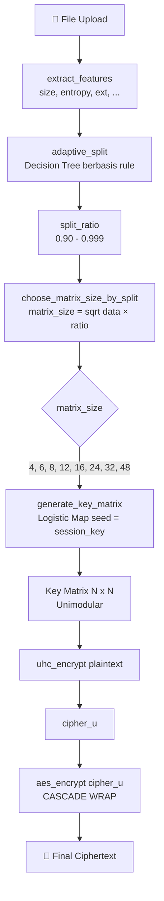

# CipherVault

Aplikasi demo FastAPI untuk autentikasi dan enkripsi, dengan frontend statis yang disajikan dari server yang sama.

## Prasyarat

- Docker + Docker Compose **atau**
- Python 3.12+

## Menjalankan dengan Docker (direkomendasikan)

Dari root project:

```bash
docker compose up --build -d
```

Cek status container:

```bash
docker compose ps
```

Lihat log:

```bash
docker compose logs -f api
```

Hentikan service:

```bash
docker compose down
```

## Menjalankan secara lokal (tanpa Docker)

Dari root project:

```bash
python -m venv .venv
source .venv/bin/activate
pip install -r requirements.txt
uvicorn backend.main:app --host 0.0.0.0 --port 8000 --reload
```

> Di Windows PowerShell, aktivasi venv: `\.venv\Scripts\Activate.ps1`

## Endpoint penting

| Endpoint               | Method | Deskripsi                                        | Auth Required |
| ---------------------- | ------ | ------------------------------------------------ | :-----------: |
| `/`                    | GET    | Frontend dashboard                               |    ✅ JWT     |
| `/login.html`          | GET    | Halaman login/register                           |      ❌       |
| `/docs`                | GET    | Swagger UI dokumentasi API                       |      ❌       |
| `/health/live`         | GET    | Liveness probe — proses API hidup                |      ❌       |
| `/health/ready`        | GET    | Readiness probe — database siap                  |      ❌       |
| `/health`              | GET    | Alias ke readiness                               |      ❌       |
| `/auth/register`       | POST   | Registrasi user baru                             |      ❌       |
| `/auth/login`          | POST   | Login, terima JWT token                          |      ❌       |
| `/auth/me`             | GET    | Ambil profil user saat ini                       |      ✅       |
| `/auth/reset-password` | POST   | Reset password (verifikasi username + email)     |      ❌       |
| `/files`               | GET    | List file milik sendiri (pagination)             |      ✅       |
| `/files/search?q=`     | GET    | Cari file berdasarkan nama                       |      ✅       |
| `/files/shared`        | GET    | List file yang dibagikan ke user ini             |      ✅       |
| `/files/{id}`          | GET    | Detail file + metadata + ai_decision             |      ✅       |
| `/files/{id}`          | DELETE | Hapus file (owner only)                          |      ✅       |
| `/files/{id}/download` | GET    | Download + dekripsi file (owner/recipient)       |      ✅       |
| `/files/{id}/share`    | POST   | Bagikan file ke user lain                        |      ✅       |
| `/files/{id}/shares`   | GET    | List semua share untuk file ini (owner only)     |      ✅       |
| `/files/shares/{id}`   | DELETE | Cabut akses share (owner only)                   |      ✅       |
| `/files/{id}/analyze`  | POST   | Analisis keamanan ciphertext (owner/recipient)   |      ✅       |
| `/files/upload`        | POST   | Upload file (multipart/form-data, field: `file`) |      ✅       |
| `/system/config`       | GET    | Konfigurasi sistem runtime                       |      ✅       |
| `/system/status`       | GET    | Status sistem (RSA, storage, database)           |      ✅       |
| `/activities`          | GET    | Log aktivitas user                               |      ✅       |

### Keterangan health endpoint

- `GET /health/live`:
  - Memastikan proses API hidup.
- `GET /health/ready`:
  - Memastikan API siap menerima traffic (termasuk pengecekan koneksi database).
  - Mengembalikan `503` jika belum siap.
- `GET /health`:
  - Alias ke readiness untuk kompatibilitas lama.

## Environment variables

Aplikasi membaca variabel dari `.env` (opsional). Jika tidak diset, nilai default dari kode akan digunakan.

Untuk memulai cepat:

```bash
cp .env.example .env
```

Variabel yang umum dipakai:

- `DATABASE_URL` (default: `sqlite:///./data/ciphervault.db`)
- `STORAGE_PATH` (default: `./data/storage`)
- `RSA_PRIVATE_KEY_PATH` (default: `./data/keys/private.pem`)
- `RSA_PUBLIC_KEY_PATH` (default: `./data/keys/public.pem`)
- `SECRET_KEY`
- `ACCESS_TOKEN_EXPIRE_MINUTES`
- `AI_MATRIX_STRATEGY` (default: `multi_feature_adaptive`, opsi: `legacy`)
- `AI_ADAPTIVE_R` (default: `true`, jika `false` pakai `UHC_LOGISTIC_R` statis)

## Fitur Frontend per Fase

### Tahap 1 — Registrasi, Login, Dashboard

- Register akun baru (`/auth/register`)
- Login dengan JWT (`/auth/login`)
- **Reset password** via `POST /auth/reset-password` (verifikasi username + email terdaftar)
- Link "Forgot Password?" pada halaman login membuka modal reset
- Dashboard menampilkan file list, stats, dan tombol upload
- Toggle tema gelap/terang

### Tahap 2 — Upload + Security Analysis

- Upload via drag-drop atau klik area upload
- Progress bar upload real-time
- Modal hasil upload dengan security score dan AI decision trace
- File muncul di list dengan encryption type dinamis dari AI Selector
- Detail file (side panel) menampilkan metadata enkripsi
- Analisis keamanan: entropi, korelasi, avalanche, NPCR, UACI, chi-square

### Tahap 3 — Download + Sharing

- **Download real** via `GET /files/{id}/download` → mendapatkan file asli hasil dekripsi
- **Share file** ke user lain (server wrapping key):
  - `POST /files/{id}/share` dengan `recipient_username`
  - Cek duplikat → 409, share diri sendiri → 400, user tidak ada → 404
- **Revoke share** — `DELETE /files/shares/{id}` (owner only)
- **Shared with Me** — tab terpisah menampilkan file yang dibagikan ke user
- Recipient bisa mendownload file identik byte-per-byte
- Setelah revoke, recipient mendapat 403 saat akses

## Alur Download (9 Langkah)

```
GET /files/{id}/download
  ├── 1. Verify ownership (owner atau recipient)
  ├── 2. Read cipher_aes dari storage
  ├── 3. Derive user_key dari derived_key_hash + salt
  ├── 4. Unwrap session_key dari wrapped_key
  ├── 5. AES decrypt → cipher_u
  ├── 6. Generate key_matrix dari logistic map
  ├── 7. UHC decrypt → plaintext
  ├── 8. Verify integrity (SHA-256 hash)
  │     ├── FAIL → 403, log incident
  │     └── PASS → return plaintext
  └── 9. Log activity
```

## Alur Sharing (Server Wrapping Key)

```
POST /files/{id}/share
  ├── 1. Verify owner → 403
  ├── 2. Find recipient → 404
  ├── 3. Owner ≠ recipient → 400
  ├── 4. Cek duplikat → 409
  ├── 5. Decrypt owner's wrapped_key → session_key
  ├── 6. Encrypt session_key dengan recipient's user_key → re-wrapped
  ├── 7. Generate access_token (random hex 64)
  ├── 8. INSERT shares record
  └── 9. Log activity
```

## Menjalankan integration test end-to-end

```bash
# Jalankan semua test
pytest -q

# Test spesifik fase 3
pytest tests/test_download_flow.py tests/test_share_flow.py -v
```

## Troubleshooting umum

- `401 Unauthorized`: token tidak valid/expired → login ulang.
- `422 Unprocessable Entity`: format request upload salah (pastikan field bernama `file`).
- Upload gagal saat startup: pastikan dependency `python-multipart` sudah terpasang (sudah ada di `requirements.txt`).
- Tombol login/register tidak merespons atau dashboard blank (`Auth.redirectIfNotLoggedIn is not a function`):
  1. Jalankan ulang container: `docker compose up --build -d`
  2. Hard refresh browser (`Ctrl+F5`) atau aktifkan `Disable cache` di DevTools.
  3. Logout dan login ulang agar token tersinkron.
- Download gagal dengan `500`: periksa log container (`docker compose logs api`). File key mismatch atau metadata korupsi mungkin penyebabnya.

## Arsitektur AI Selector Hybrid Encryption (UHC + AES)

Saat file di-upload, CipherVault tidak langsung mengenkripsi dengan parameter statis. Sebuah **AI Selector** (heuristik berbasis _rule-based decision tree_) menganalisis karakteristik file lalu memilih ukuran matriks Hill Cipher (UHC) yang paling sesuai secara adaptif. Setelah UHC selesai, outputnya dibungkus penuh oleh AES-CBC (**arsitektur CASCADE**).


### Komponen AI Selector

AI Selector berada di `backend/crypto/ai_selector.py` dan terdiri dari tiga fungsi aktif yang dipanggil berurutan saat upload:

1. **`extract_features(file_bytes, extension)`** — Mengekstrak 6 fitur dari file: `size` (byte), `entropy` (Shannon, 0–8 bit), `mean`, `std`, `unique_bytes`, dan `extension`.
2. **`adaptive_split(features)`** — Decision tree berbasis aturan yang menghasilkan rasio adaptif (0.90–0.999) berdasarkan ukuran, entropi, dan ekstensi file:
   - `> 500 MB` → `0.999`
   - `> 100 MB` → `0.995`
   - `> 10 MB` → `0.990`
   - `entropy > 7.5` → `0.985` (file sudah acak)
   - `.txt / .csv / .json` → `0.90`
   - default → `0.95`
3. **`choose_matrix_size_by_split(data_length, split_ratio)`** — Mengestimasi ukuran matriks dengan rumus `√(data_length × split_ratio)`, lalu memilih elemen terbesar dari `SUPPORTED_MATRIX_SIZES = (4, 6, 8, 12, 16, 24, 32, 48)` yang tidak melebihi estimasi tersebut.

### Alur End-to-End



### Catatan Implementasi

- **"AI" di sini adalah _Adaptive Heuristic AI_**, bukan machine learning. Tidak ada model terlatih atau bobot neural — sistem menggunakan _rule-based decision tree_ yang menyesuaikan parameter kripto berdasarkan analisis input. Pendekatan ini konsisten dengan referensi paper "AI-Assisted Hybrid Cryptosystem".
- **Mode CASCADE:** Karena AES membungkus seluruh output UHC, variabel `split_ratio` **tidak benar-benar memecah data**. Rasio tersebut hanya dipakai sebagai input fuzzy untuk menentukan ukuran matriks terbaik.
- **Fungsi alternatif:** `pilih_matriks_ai(file_bytes)` juga tersedia (mengikuti referensi UHC+AES asli secara harfiah) tetapi saat ini tidak dipanggil oleh upload service.

## Menjalankan test

```bash
pytest -q
```
