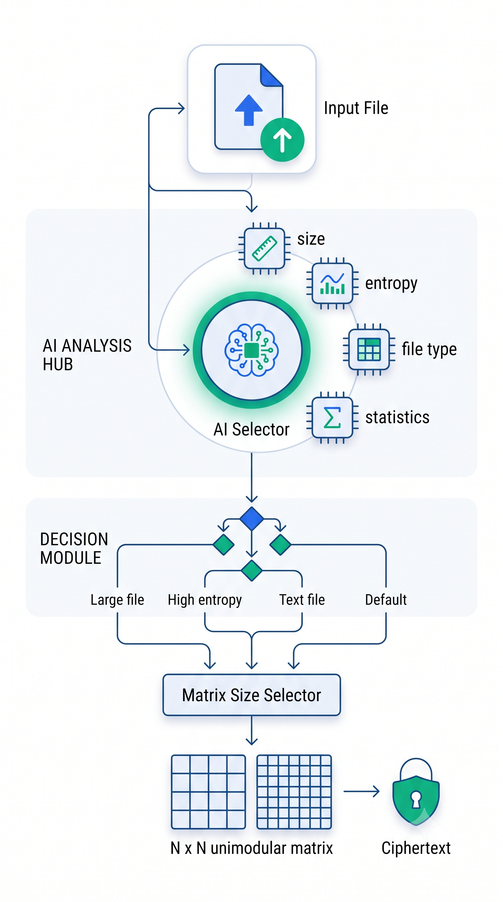
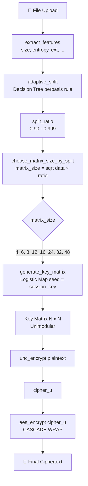

# CipherVault

Aplikasi demo FastAPI untuk autentikasi dan enkripsi, dengan frontend statis yang disajikan dari server yang sama.

## Prasyarat

- Docker + Docker Compose **atau**
- Python 3.12+

## Menjalankan dengan Docker (direkomendasikan)

Dari root project:

```bash
docker compose up --build -d
```

Cek status container:

```bash
docker compose ps
```

Lihat log:

```bash
docker compose logs -f api
```

Hentikan service:

```bash
docker compose down
```

## Menjalankan secara lokal (tanpa Docker)

Dari root project:

```bash
python -m venv .venv
source .venv/bin/activate
pip install -r requirements.txt
uvicorn backend.main:app --host 0.0.0.0 --port 8000 --reload
```

> Di Windows PowerShell, aktivasi venv: `\.venv\Scripts\Activate.ps1`

## Endpoint penting

- Frontend: `http://127.0.0.1:8000/`
- Swagger UI: `http://127.0.0.1:8000/docs`
- Health (legacy alias): `http://127.0.0.1:8000/health`
- Liveness probe: `http://127.0.0.1:8000/health/live`
- Readiness probe: `http://127.0.0.1:8000/health/ready`

### Keterangan health endpoint

- `GET /health/live`:
  - Memastikan proses API hidup.
- `GET /health/ready`:
  - Memastikan API siap menerima traffic (termasuk pengecekan koneksi database).
  - Mengembalikan `503` jika belum siap.
- `GET /health`:
  - Alias ke readiness untuk kompatibilitas lama.

## Environment variables

Aplikasi membaca variabel dari `.env` (opsional). Jika tidak diset, nilai default dari kode akan digunakan.

Untuk memulai cepat:

```bash
cp .env.example .env
```

Variabel yang umum dipakai:

- `DATABASE_URL` (default: `sqlite:///./data/ciphervault.db`)
- `STORAGE_PATH` (default: `./data/storage`)
- `RSA_PRIVATE_KEY_PATH` (default: `./data/keys/private.pem`)
- `RSA_PUBLIC_KEY_PATH` (default: `./data/keys/public.pem`)
- `SECRET_KEY`
- `ACCESS_TOKEN_EXPIRE_MINUTES`
- `AI_MATRIX_STRATEGY` (default: `multi_feature_adaptive`, opsi: `legacy`)
- `AI_ADAPTIVE_R` (default: `true`, jika `false` pakai `UHC_LOGISTIC_R` statis)

## Upload file dari frontend

Ya, upload dari frontend sudah didukung.

Langkah uji cepat:

1. Jalankan aplikasi (Docker atau lokal).
2. Buka `http://127.0.0.1:8000/login.html`.
3. Register user baru, lalu login.
4. Setelah masuk dashboard (`/`), upload file lewat drag-drop zone atau klik area upload.
5. Pastikan progress berjalan, muncul toast sukses, file muncul di list, dan modal security analysis tampil.

Request yang dipakai frontend:

- `POST /files/upload` dengan `multipart/form-data`
- field file: `file`

Troubleshooting umum:

- `401 Unauthorized`: token tidak valid/expired → login ulang.
- `422 Unprocessable Entity`: format request upload salah (pastikan field bernama `file`).
- Upload gagal saat startup: pastikan dependency `python-multipart` sudah terpasang (sudah ada di `requirements.txt`).
- Tombol login/register tidak merespons atau dashboard blank (`Auth.redirectIfNotLoggedIn is not a function`):
  1. Jalankan ulang container: `docker compose up --build -d`
  2. Hard refresh browser (`Ctrl+F5`) atau aktifkan `Disable cache` di DevTools.
  3. Logout dan login ulang agar token tersinkron.

## Arsitektur AI Selector Hybrid Encryption (UHC + AES)

Saat file di-upload, CipherVault tidak langsung mengenkripsi dengan parameter statis. Sebuah **AI Selector** (heuristik berbasis _rule-based decision tree_) menganalisis karakteristik file lalu memilih ukuran matriks Hill Cipher (UHC) yang paling sesuai secara adaptif. Setelah UHC selesai, outputnya dibungkus penuh oleh AES-CBC (**arsitektur CASCADE**).



### Komponen AI Selector

AI Selector berada di `backend/crypto/ai_selector.py` dan terdiri dari tiga fungsi aktif yang dipanggil berurutan saat upload:

1. **`extract_features(file_bytes, extension)`** — Mengekstrak 6 fitur dari file: `size` (byte), `entropy` (Shannon, 0–8 bit), `mean`, `std`, `unique_bytes`, dan `extension`.
2. **`adaptive_split(features)`** — Decision tree berbasis aturan yang menghasilkan rasio adaptif (0.90–0.999) berdasarkan ukuran, entropi, dan ekstensi file:
   - `> 500 MB` → `0.999`
   - `> 100 MB` → `0.995`
   - `> 10 MB` → `0.990`
   - `entropy > 7.5` → `0.985` (file sudah acak)
   - `.txt / .csv / .json` → `0.90`
   - default → `0.95`
3. **`choose_matrix_size_by_split(data_length, split_ratio)`** — Mengestimasi ukuran matriks dengan rumus `√(data_length × split_ratio)`, lalu memilih elemen terbesar dari `SUPPORTED_MATRIX_SIZES = (4, 6, 8, 12, 16, 24, 32, 48)` yang tidak melebihi estimasi tersebut.

### Alur End-to-End



### Catatan Implementasi

- **"AI" di sini adalah _Adaptive Heuristic AI_**, bukan machine learning. Tidak ada model terlatih atau bobot neural — sistem menggunakan _rule-based decision tree_ yang menyesuaikan parameter kripto berdasarkan analisis input. Pendekatan ini konsisten dengan referensi paper "AI-Assisted Hybrid Cryptosystem".
- **Mode CASCADE:** Karena AES membungkus seluruh output UHC, variabel `split_ratio` **tidak benar-benar memecah data**. Rasio tersebut hanya dipakai sebagai input fuzzy untuk menentukan ukuran matriks terbaik.
- **Fungsi alternatif:** `pilih_matriks_ai(file_bytes)` juga tersedia (mengikuti referensi UHC+AES asli secara harfiah) tetapi saat ini tidak dipanggil oleh upload service.

## Menjalankan test

```bash
pytest -q
```
