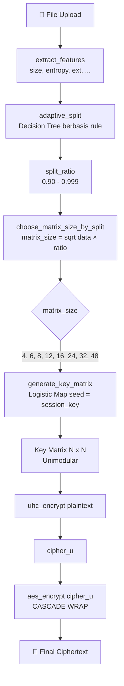

# CipherVault

Aplikasi untuk autentikasi dan enkripsi, dengan frontend statis yang disajikan dari server yang sama.

## Prasyarat

- Docker + Docker Compose **atau**
- Python 3.12+

## Menjalankan dengan Docker (direkomendasikan)

Dari root project:

```bash
docker compose up --build -d
```

Cek status container:

```bash
docker compose ps
```

Lihat log:

```bash
docker compose logs -f api
```

Hentikan service:

```bash
docker compose down
```

> **Host port:** `docker-compose.yml` memetakan **`3000:8000`** (host 3000 → container 8000). Jadi aplikasi diakses via `http://<host>:3000`. Port internal container tetap `8000`.

## Deployment Produksi (VPS / Server Remote)

Proyek ini sudah siap di-deploy ke server VPS via **remote git + Docker Compose** (tanpa GitHub). Ganti placeholder `YOUR_USER` dan `YOUR_SERVER_IP` dengan kredensial server kamu.

### 1. Buat bare repo di server

```bash
ssh YOUR_USER@YOUR_SERVER_IP
mkdir -p /opt/ciphervault.git
cd /opt/ciphervault.git
git init --bare
git symbolic-ref HEAD refs/heads/master
exit
```

### 2. Tambah remote dari lokal

```bash
git remote add origin YOUR_USER@YOUR_SERVER_IP:/opt/ciphervault.git
git push -u origin master
```

### 3. Auto-deploy via post-receive hook

```bash
ssh YOUR_USER@YOUR_SERVER_IP
cd /opt/ciphervault.git/hooks
cat > post-receive <<'EOF'
#!/bin/sh
GIT_WORK_TREE=/opt/ciphervault GIT_DIR=/opt/ciphervault.git git checkout -f
cd /opt/ciphervault && docker compose up --build -d
EOF
chmod +x post-receive
exit
```

Setiap `git push` lokal otomatis checkout kode → rebuild → restart container di port `3000`.

### 4. Salin `.env` dan `data/` ke server (WAJIB)

Keduanya di-ignore git, jadi tidak ikut terkirim:

```bash
scp .env YOUR_USER@YOUR_SERVER_IP:/opt/ciphervault/.env
rsync -av data/ YOUR_USER@YOUR_SERVER_IP:/opt/ciphervault/data/
```

> `data/` berisi RSA keys + database + storage ciphertext. Jika tidak disalin, file terenkripsi lama tidak bisa didekripsi (key mismatch → download `500`).

### 5. Buka firewall

Buka **port `3000`** di security group / firewall cloud provider, lalu akses `http://YOUR_SERVER_IP:3000`.

## Menjalankan secara lokal (tanpa Docker)

Dari root project:

```bash
python -m venv .venv
source .venv/bin/activate
pip install -r requirements.txt
uvicorn backend.main:app --host 0.0.0.0 --port 8000 --reload
```

> Di Windows PowerShell, aktivasi venv: `\.venv\Scripts\Activate.ps1`

## Default Accounts (seeded)

Saat pertama kali dijalankan, sistem otomatis membuat akun default:

| Username | Password    | Email                | Role  |
| -------- | ----------- | -------------------- | ----- |
| `admin`  | `Admin123!` | admin@ciphervault.io | admin |
| `user`   | `User123!`  | user@ciphervault.io  | user  |

- **Admin**: dapat melihat konfigurasi teknis, entropy, parameter kripto, dan mengelola semua user.
- **User**: hanya upload/download/share/file management — tidak melihat parameter kripto.

## Endpoint penting

| Endpoint                           | Method | Deskripsi                                                |   Auth    |
| ---------------------------------- | ------ | -------------------------------------------------------- | :-------: |
| `/`                                | GET    | Frontend dashboard                                       |  ✅ JWT   |
| `/login.html`                      | GET    | Halaman login/register                                   |    ❌     |
| `/docs`                            | GET    | Swagger UI dokumentasi API                               |    ❌     |
| `/health/live`                     | GET    | Liveness probe — proses API hidup                        |    ❌     |
| `/health/ready`                    | GET    | Readiness probe — database siap                          |    ❌     |
| `/health`                          | GET    | Alias ke readiness                                       |    ❌     |
| `/auth/register`                   | POST   | Registrasi user baru (role: user)                        |    ❌     |
| `/auth/login`                      | POST   | Login, terima JWT token                                  |    ❌     |
| `/auth/me`                         | GET    | Ambil profil user saat ini                               | JWT / Key |
| `/auth/reset-password`             | POST   | Reset password (verifikasi username + email)             |    ❌     |
| `/files/upload`                    | POST   | Upload + enkripsi file (field: `file`, opt: `parent_id`) | JWT / Key |
| `/files`                           | GET    | List file milik sendiri (excludes dirs)                  | JWT / Key |
| `/files/search?q=`                 | GET    | Cari file berdasarkan nama                               | JWT / Key |
| `/files/shared`                    | GET    | List file yang dibagikan ke user ini                     | JWT / Key |
| `/files/{id}`                      | GET    | Detail file + metadata + ai_decision                     | JWT / Key |
| `/files/{id}`                      | DELETE | Hapus file (owner only)                                  | JWT / Key |
| `/files/{id}/analyze`              | POST   | Analisis keamanan ciphertext                             | ✅ Admin  |
| `/files/{id}/verify`               | POST   | Verifikasi integritas tanpa download                     | JWT / Key |
| `/files/{id}/download`             | GET    | Download + dekripsi file                                 | JWT / Key |
| `/files/{id}/download/cipher`      | GET    | Download raw ciphertext                                  | JWT / Key |
| `/files/{id}/move`                 | PATCH  | Pindahkan file/folder ke folder lain                     | JWT / Key |
| `/files/{id}/share`                | POST   | Bagikan file ke user lain                                | JWT / Key |
| `/files/{id}/shares`               | GET    | List semua share untuk file ini                          | JWT / Key |
| `/files/shares/{id}`               | DELETE | Cabut akses share (owner only)                           | JWT / Key |
| `/files/{id}/public-link`          | POST   | Buat public link (password/expiry/limit opt)             | JWT / Key |
| `/files/{id}/public-links`         | GET    | List public links untuk file                             | JWT / Key |
| `/public-links/{id}`               | DELETE | Cabut public link                                        | JWT / Key |
| `/public/{token}`                  | GET    | Download via public link (no auth, opt: password)        |    ❌     |
| `/files/directories`               | POST   | Buat folder baru                                         | JWT / Key |
| `/files/directories`               | GET    | Isi folder (root jika tanpa parent_id)                   | JWT / Key |
| `/files/directories/{id}`          | DELETE | Hapus folder (rekursif)                                  | JWT / Key |
| `/api-keys`                        | POST   | Buat API key (key ditampilkan sekali)                    |  ✅ JWT   |
| `/api-keys`                        | GET    | List API keys milik user                                 | JWT / Key |
| `/api-keys/{id}`                   | DELETE | Cabut API key                                            | JWT / Key |
| `/system/config`                   | GET    | Konfigurasi sistem runtime                               | ✅ Admin  |
| `/system/status`                   | GET    | Status sistem (RSA, storage, database)                   | ✅ Admin  |
| `/admin/users`                     | GET    | List semua user (pagination)                             | ✅ Admin  |
| `/admin/users/{id}`                | GET    | Detail user                                              | ✅ Admin  |
| `/admin/users/{id}/role`           | PATCH  | Ubah role user (admin/user)                              | ✅ Admin  |
| `/admin/users/{id}/active`         | PATCH  | Aktifkan/nonaktifkan user                                | ✅ Admin  |
| `/admin/users/{id}/reset-password` | POST   | Reset password user                                      | ✅ Admin  |
| `/admin/users/{id}`                | DELETE | Hapus user                                               | ✅ Admin  |
| `/admin/stats`                     | GET    | Statistik sistem (users, files, shares, storage)         | ✅ Admin  |
| `/admin/security/stats`            | GET    | Metrik keamanan global (entropy, score per file)         | ✅ Admin  |
| `/activities`                      | GET    | Log aktivitas user                                       | JWT / Key |

### Keterangan health endpoint

- `GET /health/live`:
  - Memastikan proses API hidup.
- `GET /health/ready`:
  - Memastikan API siap menerima traffic (termasuk pengecekan koneksi database).
  - Mengembalikan `503` jika belum siap.
- `GET /health`:
  - Alias ke readiness untuk kompatibilitas lama.

## Environment variables

Aplikasi membaca variabel dari `.env` (opsional). Jika tidak diset, nilai default dari kode akan digunakan.

Untuk memulai cepat:

```bash
cp .env.example .env
```

Variabel yang umum dipakai:

- `DATABASE_URL` (default: `sqlite:///./data/ciphervault.db`)
- `STORAGE_PATH` (default: `./data/storage`)
- `RSA_PRIVATE_KEY_PATH` (default: `./data/keys/private.pem`)
- `RSA_PUBLIC_KEY_PATH` (default: `./data/keys/public.pem`)
- `SECRET_KEY`
- `ACCESS_TOKEN_EXPIRE_MINUTES`
- `AI_MATRIX_STRATEGY` (default: `multi_feature_adaptive`, opsi: `legacy`)
- `AI_ADAPTIVE_R` (default: `true`, jika `false` pakai `UHC_LOGISTIC_R` statis)
- `MAX_UPLOAD_BYTES` (default: `1048576` / 1 MB, batas maksimal ukuran file upload; sesuaikan untuk production)

### Otentikasi Ganda — JWT atau API Key

Semua endpoint yang memerlukan auth menerima **dua metode**:

1. **JWT Bearer** — `Authorization: Bearer <token>` (dari login)
2. **API Key** — `X-API-Key: cv_...` (dari Profile → Generate)

Pengecualian: `POST /api-keys` hanya menerima JWT (tidak bisa membuat key dengan key lain).

## Fitur Frontend per Fase

### Tahap 1 — Registrasi, Login, Dashboard

- Register akun baru (`/auth/register`)
- Login dengan JWT (`/auth/login`)
- **Reset password** via `POST /auth/reset-password` (verifikasi username + email terdaftar)
- Link "Forgot Password?" pada halaman login membuka modal reset
- Dashboard menampilkan file list, stats, dan tombol upload
- Toggle tema gelap/terang

### Tahap 2 — Upload + Security Analysis

- Upload via drag-drop atau klik area upload
- Progress bar upload real-time
- Modal hasil upload dengan security score dan AI decision trace
- File muncul di list dengan encryption type dinamis dari AI Selector
- Detail file (side panel) menampilkan metadata enkripsi
- Analisis keamanan: entropi, korelasi, avalanche, NPCR, UACI, chi-square

### Tahap 3 — Download + Sharing

- **Download real** via `GET /files/{id}/download` → mendapatkan file asli hasil dekripsi
- **Share file** ke user lain (server wrapping key):
  - `POST /files/{id}/share` dengan `recipient_username`
  - Cek duplikat → 409, share diri sendiri → 400, user tidak ada → 404
- **Revoke share** — `DELETE /files/shares/{id}` (owner only)
- **Shared with Me** — tab terpisah menampilkan file yang dibagikan ke user
- Recipient bisa mendownload file identik byte-per-byte
- Setelah revoke, recipient mendapat 403 saat akses

### Tahap 4 — Directory Management

- **Folder hirarkis** seperti Google Drive / Dropbox
- Buat folder root dan subfolder via `POST /files/directories`
- Navigasi folder dengan breadcrumb di dashboard
- Pindahkan file antar folder via `PATCH /files/{id}/move`
- Hapus folder via `DELETE /files/directories/{id}`
- List konten folder via `GET /files/directories` (file + subfolder)
- Integrasi penuh dengan upload, download, dan sharing

## Alur Download (9 Langkah)

```
GET /files/{id}/download
  ├── 1. Verify ownership (owner atau recipient)
  ├── 2. Read cipher_aes dari storage
  ├── 3. Derive user_key dari derived_key_hash + salt
  ├── 4. Unwrap session_key dari wrapped_key
  ├── 5. AES decrypt → cipher_u
  ├── 6. Generate key_matrix dari logistic map
  ├── 7. UHC decrypt → plaintext
  ├── 8. Verify integrity (SHA-256 hash)
  │     ├── FAIL → 403, log incident
  │     └── PASS → return plaintext
  └── 9. Log activity
```

## Alur Sharing (Server Wrapping Key)

```
POST /files/{id}/share
  ├── 1. Verify owner → 403
  ├── 2. Find recipient → 404
  ├── 3. Owner ≠ recipient → 400
  ├── 4. Cek duplikat → 409
  ├── 5. Decrypt owner's wrapped_key → session_key
  ├── 6. Encrypt session_key dengan recipient's user_key → re-wrapped
  ├── 7. Generate access_token (random hex 64)
  ├── 8. INSERT shares record
  └── 9. Log activity
```

## Menjalankan integration test end-to-end

```bash
# Jalankan semua test
pytest -q

# Test spesifik fase 3
pytest tests/test_download_flow.py tests/test_share_flow.py -v
```

## Troubleshooting umum

- `401 Unauthorized`: token tidak valid/expired → login ulang.
- `422 Unprocessable Entity`: format request upload salah (pastikan field bernama `file`).
- Upload gagal saat startup: pastikan dependency `python-multipart` sudah terpasang (sudah ada di `requirements.txt`).
- Tombol login/register tidak merespons atau dashboard blank (`Auth.redirectIfNotLoggedIn is not a function`):
  1. Jalankan ulang container: `docker compose up --build -d`
  2. Hard refresh browser (`Ctrl+F5`) atau aktifkan `Disable cache` di DevTools.
  3. Logout dan login ulang agar token tersinkron.
- Download gagal dengan `500`: periksa log container (`docker compose logs api`). File key mismatch atau metadata korupsi mungkin penyebabnya.

### Tahap 5 — Production Ready (v6)

- **RBAC dua tier**: `admin` (lihat parameter kripto, kelola user) vs `user` (hanya operasi file)
- **Admin Panel** — kelola user: promote/demote, activate/deactivate, reset password, delete
- **System Stats** — total users, files, shares, storage, API keys, recent activities
- **Security Stats** — avg entropy, avg score, per-file metrics untuk semua file terenkripsi
- **API Keys** — generate/revoke keys untuk akses programatik (key ditampilkan sekali)
- **Public Links** — share file tanpa login (password, expiry, download limit opsional)
- **Directory Management** — folder hirarkis seperti Google Drive
- **Verify Integrity** — cek integritas file tanpa download (`POST /files/{id}/verify`)
- **Download Ciphertext** — download raw ciphertext (`GET /files/{id}/download/cipher`)
- **Seeder** — akun default `admin`/`Admin123!` dan `user`/`User123!`

## Otentikasi API

### Membuat API Key

1. Login ke dashboard → klik ikon Profile di navbar
2. Klik **Generate** di section API Keys
3. Simpan key yang ditampilkan (hanya muncul sekali)

### Contoh Penggunaan API Key

```bash
# Upload file
curl -X POST http://localhost:8000/files/upload \
  -H "X-API-Key: cv_your_key_here" \
  -F "file=@document.pdf"

# List files
curl -H "X-API-Key: cv_your_key_here" http://localhost:8000/files

# Download file
curl -H "X-API-Key: cv_your_key_here" \
  -o decrypted.pdf \
  http://localhost:8000/files/1/download

# Create public link
curl -X POST http://localhost:8000/files/1/public-link \
  -H "X-API-Key: cv_your_key_here" \
  -H "Content-Type: application/json" \
  -d '{"max_access": 10, "expires_in_hours": 24}'
```

## Arsitektur AI Selector Hybrid Encryption (UHC + AES)

Saat file di-upload, CipherVault tidak langsung mengenkripsi dengan parameter statis. Sebuah **AI Selector** (heuristik berbasis _rule-based decision tree_) menganalisis karakteristik file lalu memilih ukuran matriks Hill Cipher (UHC) yang paling sesuai secara adaptif. Setelah UHC selesai, outputnya dibungkus penuh oleh AES-CBC (**arsitektur CASCADE**).


### Komponen AI Selector

AI Selector berada di `backend/crypto/ai_selector.py` dan terdiri dari tiga fungsi aktif yang dipanggil berurutan saat upload:

1. **`extract_features(file_bytes, extension)`** — Mengekstrak 6 fitur dari file: `size` (byte), `entropy` (Shannon, 0–8 bit), `mean`, `std`, `unique_bytes`, dan `extension`.
2. **`adaptive_split(features)`** — Decision tree berbasis aturan yang menghasilkan rasio adaptif (0.90–0.999) berdasarkan ukuran, entropi, dan ekstensi file:
   - `> 500 MB` → `0.999`
   - `> 100 MB` → `0.995`
   - `> 10 MB` → `0.990`
   - `entropy > 7.5` → `0.985` (file sudah acak)
   - `.txt / .csv / .json` → `0.90`
   - default → `0.95`
3. **`choose_matrix_size_by_split(data_length, split_ratio)`** — Mengestimasi ukuran matriks dengan rumus `√(data_length × split_ratio)`, lalu memilih elemen terbesar dari `SUPPORTED_MATRIX_SIZES = (4, 6, 8, 12, 16, 24, 32, 48)` yang tidak melebihi estimasi tersebut.

### Alur End-to-End



### Catatan Implementasi

- **"AI" di sini adalah _Adaptive Heuristic AI_**, bukan machine learning. Tidak ada model terlatih atau bobot neural — sistem menggunakan _rule-based decision tree_ yang menyesuaikan parameter kripto berdasarkan analisis input. Pendekatan ini konsisten dengan referensi paper "AI-Assisted Hybrid Cryptosystem".
- **Mode CASCADE:** Karena AES membungkus seluruh output UHC, variabel `split_ratio` **tidak benar-benar memecah data**. Rasio tersebut hanya dipakai sebagai input fuzzy untuk menentukan ukuran matriks terbaik.
- **Fungsi alternatif:** `pilih_matriks_ai(file_bytes)` juga tersedia (mengikuti referensi UHC+AES asli secara harfiah) tetapi saat ini tidak dipanggil oleh upload service.

## Menjalankan test

```bash
pytest -q
```
