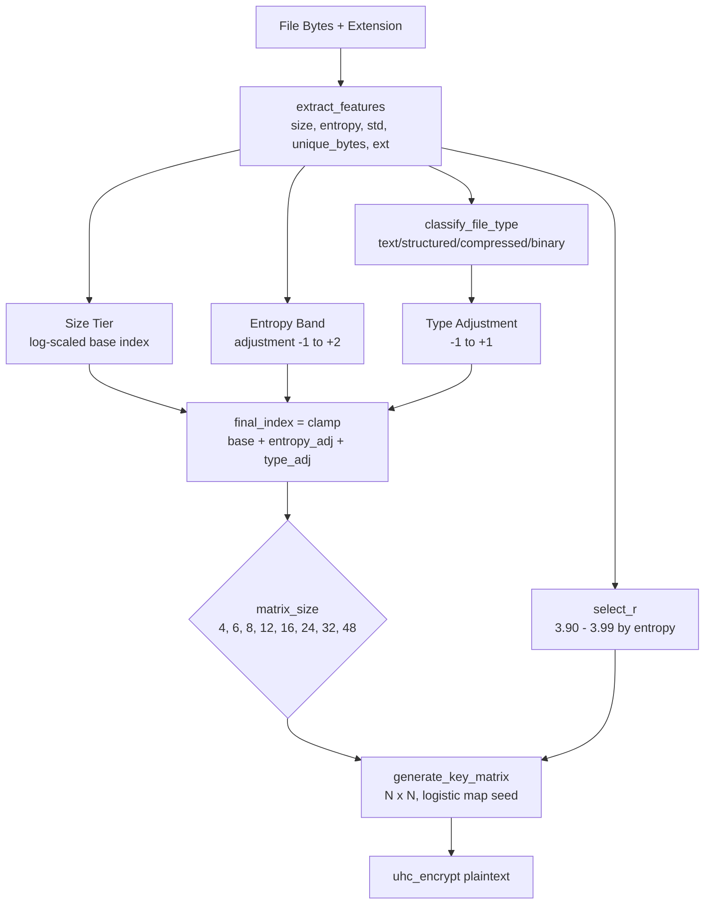

# Dokumen Rencana Pengembangan Aplikasi CipherVault

**Versi Dokumen:** 6.0 **Tanggal:** 4 Agustus 2026 **Versi Aplikasi:** 1.0.0 **Status:** Active Development — Production Target

---

## Daftar Isi

1. [Pendahuluan](#1-pendahuluan)
2. [Tinjauan Sistem](#2-tinjauan-sistem)
3. [Teknologi yang Digunakan](#3-teknologi-yang-digunakan)
4. [Arsitektur Sistem](#4-arsitektur-sistem)
5. [Desain Database](#5-desain-database)
6. [Desain API (Endpoint)](#6-desain-api-endpoint)
7. [Alur Enkripsi dan Dekripsi](#7-alur-enkripsi-dan-dekripsi)
8. [Struktur File Proyek](#8-struktur-file-proyek)
9. [Rencana Pengembangan Bertahap](#9-rencana-pengembangan-bertahap)
10. [Rencana Pengujian](#10-rencana-pengujian)
11. [Keamanan Sistem](#11-keamanan-sistem)
12. [Risiko dan Mitigasi](#12-risiko-dan-mitigasi)
13. [Timeline Proyek](#13-timeline-proyek)
14. [Lampiran](#14-lampiran)

---

## 1\. Pendahuluan

### 1.1 Latar Belakang

Penyimpanan cloud telah menjadi kebutuhan utama dalam pengelolaan data digital. Namun, kebanyakan layanan cloud storage yang ada today hanya mengandalkan enkripsi sisi server (_server-side encryption_), di mana penyedia layanan tetap memiliki akses terhadap kunci enkripsi dan data pengguna. Hal ini menimbulkan risiko kebocoran data apabila terjadi insiden keamanan di sisi penyedia.

CipherVault hadir sebagai solusi penyimpanan cloud yang menerapkan prinsip **Zero-Knowledge Encryption** — di mana seluruh proses enkripsi dan dekripsi terjadi di sisi klien/server aplikasi, dan penyimpanan cloud hanya menerima ciphertext yang tidak dapat dibaca tanpa kunci yang dipegang oleh pengguna.

### 1.2 Tujuan Proyek

Membangun aplikasi cloud storage terenkripsi siap deploy dan siap jual dengan kemampuan:

- **Two-tier RBAC** — role `admin` (akses penuh + security dashboard teknis) dan `user` (pengguna akhir)
- AI Adaptive Split — rasio enkripsi dinamis berdasarkan fitur file (size, entropy, mean, std, unique bytes, extension)
- Enkripsi berlapis tiga: **UHC** mod 257 (inner) → **AES-256-CBC** (middle) → **RSA-OAEP** wrap session key
- Manajemen kunci sesi (_session key_) yang aman per file
- Pengunggahan file aman (_secure upload_) dengan return URL ciphertext & plaintext
- Pengunduhan file aman dengan verifikasi integritas (_secure download_)
- Pembagian file aman — user-to-user (re-encryption) dan **public link** (token HMAC-SHA256)
- Manajemen direktori hirarkis (folder, sub-folder, breadcrumb) seperti Google Drive / Dropbox
- **API Key** per user — autentikasi alternatif JWT untuk integrasi eksternal
- Security Analysis Engine — hanya tampil ke role `admin` (entropi, korelasi, avalanche, NPCR, UACI, score 0-100)
- Operasi CRUD file, pencarian, direktori, dan pencatatan aktivitas
- Seeder default: 1 akun admin + 1 akun user untuk kemudahan onboarding
- Siap deploy production: email verification, rate limiting, HTTPS enforcement, quota storage per user (direncanakan)

### 1.3 Ruang Lingkup

| Termasuk (V1)                                                  | Tidak Termasuk / Future                      |
| :------------------------------------------------------------- | :------------------------------------------- |
| Enkripsi UHC + Hybrid AES/RSA + AI Adaptive Split              | Enkripsi end-to-end di browser (client-side) |
| Autentikasi JWT + API Key                                      | OAuth/SSO pihak ketiga                       |
| RBAC dua peran: `admin` dan `user`                             | Multi-tenant (satu instance per organisasi)  |
| Sharing user-to-user + public link (HMAC token)                | Collaborative editing                        |
| Security Analysis Engine — hanya untuk `admin`                 | Analisis kriptanalisis lanjutan              |
| Manajemen direktori hirarkis (folder, breadcrumb, pindah file) | Google Drive-style real-time sync            |
| Penyimpanan lokal (abstraksi cloud-ready)                      | Integrasi S3/GCS langsung (hanya abstraksi)  |
| Verifikasi integritas SHA-256                                  | Digital signature / PKI                      |
| Pencarian file berdasarkan nama                                | Full-text search dalam isi file              |
| Seeder: akun admin + user default                              | —                                            |
| Return URL ciphertext & plaintext setelah upload               | —                                            |
| Semua parameter enkripsi via .env                              | —                                            |
| Email verification (planned — Fase 5)                          | —                                            |
| Rate limiting, quota storage per user (planned — Fase 5)       | —                                            |

---

## 2\. Tinjauan Sistem

### 2.1 Peta Fitur Sistem

Berdasarkan analisis diagram alur yang telah dirancang, sistem CipherVault memiliki struktur fitur sebagai berikut:

CipherVault

├── Autentikasi & Otorisasi

│ ├── Registrasi User

│ ├── Login (JWT)

│ ├── Reset Password

│ ├── Verifikasi Sesi (JWT / API Key)

│ └── RBAC (role: admin / user)

│

├── Secure Upload (Basic Flow)

│ ├── Pilih File

│ ├── Generate Session Key

│ ├── UHC Encryption (inner)

│ ├── AES Encryption (outer)

│ ├── Generate Metadata

│ ├── Upload Ciphertext

│ └── Store on Cloud

│

├── Secure Download

│ ├── Pilih File

│ ├── Verify Ownership

│ ├── Retrieve Ciphertext

│ ├── AES Decryption (outer)

│ ├── UHC Decryption (inner)

│ ├── Integrity Check

│ └── Save Plaintext

│

├── Secure File Sharing

│ ├── Share ke User Terdaftar (Re-encrypt Session Key)

│ └── Public Link (HMAC-SHA256 token, optional expiry)

│

├── API Key Management

│ ├── Generate API Key

│ ├── List API Key

│ └── Revoke API Key

│

├── Admin Dashboard

│ ├── List & Manage Users (CRUD role)

│ ├── System Statistics

│ └── Security Analysis Global

│

└── Manajemen File

    ├── Daftar File

    ├── Direktori / Folder

    │   ├── Buat Folder

    │   ├── Hapus Folder

    │   ├── Pindahkan File / Folder

    │   └── Navigasi Folder (Breadcrumb)

    ├── Update File (re-upload)

    ├── Delete File

    ├── Verify Integrity

    └── Search File

### 2.2 Aktor Sistem

| Aktor       | Role DB | Deskripsi                                                                             |
| :---------- | :------ | :------------------------------------------------------------------------------------ |
| **Admin**   | `admin` | Akses penuh: lihat security dashboard teknis, manage user (CRUD role), system stats   |
| **User**    | `user`  | Upload, download, share, public link, direktori. Tidak melihat detail teknis enkripsi |
| **Public**  | —       | Akses file via public link token tanpa login (hanya download plaintext)               |
| **Sistem**  | —       | Backend: enkripsi, penyimpanan, manajemen kunci                                       |
| **Storage** | —       | Komponen penyimpanan ciphertext (lokal / cloud-abstracted)                            |

---

## 3\. Teknologi yang Digunakan

### 3.1 Backend

| Komponen             | Teknologi         | Versi  | Fungsi                                                        |
| :------------------- | :---------------- | :----- | :------------------------------------------------------------ |
| Framework            | FastAPI           | 0.115+ | Web framework async, auto-generate OpenAPI docs               |
| Bahasa               | Python            | 3.10+  | Bahasa pemrograman utama                                      |
| ORM                  | SQLAlchemy        | 2.0+   | Object-Relational Mapping untuk database                      |
| Validasi             | Pydantic          | 2.9+   | Validasi request/response body                                |
| Autentikasi          | python-jose       | 3.3+   | Pembuatan dan verifikasi JWT                                  |
| Hashing              | bcrypt            | 4.2+   | Hashing password user                                         |
| Enkripsi AES         | PyCryptodome      | 3.20+  | Implementasi AES-256-CBC                                      |
| Enkripsi UHC         | Modul Kustom      | —      | Algoritma UHC dengan modulus configurable (256/257)           |
| Enkripsi RSA         | PyCryptodome      | 3.20+  | RSA-OAEP 2048-bit untuk hybrid key wrapping                   |
| Logistic Map         | Modul Kustom      | —      | PRNG dengan parameter r configurable                          |
| AI Feature Extractor | numpy             | 1.24+  | Ekstraksi fitur file: size, entropy, mean, std, unique, ext   |
| AI Adaptive Split    | Modul Kustom      | —      | Rule-based split ratio berdasarkan fitur                      |
| Security Analyzer    | scipy + numpy     | —      | Analisis entropi, korelasi, avalanche, NPCR, UACI, chi-square |
| File Async           | aiofiles          | 24.1+  | Pembacaan/penulisan file non-blocking                         |
| Konfigurasi          | pydantic-settings | 2.5+   | Manajemen konfigurasi dari .env                               |

### 3.2 Frontend

| Komponen | Teknologi                 | Fungsi                                |
| :------- | :------------------------ | :------------------------------------ |
| Struktur | HTML5                     | Halaman dan komponen UI               |
| Styling  | CSS3                      | Desain dark theme, responsive         |
| Logika   | Vanilla JavaScript (ES6+) | Interaksi, API call, state management |
| Ikon     | SVG inline                | Ikon UI tanpa dependency eksternal    |

### 3.3 Database & Storage

| Komponen     | Teknologi                             | Fungsi                                   |
| :----------- | :------------------------------------ | :--------------------------------------- |
| Database     | SQLite (dev) → PostgreSQL (prod)      | Penyimpanan metadata, user, keys, shares |
| File Storage | Local Filesystem (abstraksi S3-ready) | Penyimpanan ciphertext                   |

### 3.4 Pengujian

| Komponen      | Teknologi            | Fungsi                                |
| :------------ | :------------------- | :------------------------------------ |
| Framework     | pytest               | Test runner                           |
| HTTP Test     | TestClient (FastAPI) | Pengujian endpoint tanpa server hidup |
| Database Test | SQLite in-memory     | Database sementara per test           |

---

## 4\. Arsitektur Sistem

### 4.1 Arsitektur Layered

┌─────────────────────────────────────────────────────────────────┐

│ PRESENTATION LAYER │

│ (Frontend: HTML/CSS/JS) │

│ │

│ Login Page │ Dashboard │ Upload Zone │ File List │

│ Share Modal │ Search Bar │ Toast/Alert │ Progress Bar │

└─────────────────────────┬───────────────────────────────────────┘

                          │  HTTP Request (JSON / Multipart)

                          ▼

┌─────────────────────────────────────────────────────────────────┐

│ API GATEWAY LAYER │

│ (FastAPI Routers) │

│ │

│ auth.py │ upload.py │ download.py │ files.py │ share │

└─────────────────────────┬───────────────────────────────────────┘

                          │

                          ▼

┌─────────────────────────────────────────────────────────────────┐

│ MIDDLEWARE LAYER │

│ │

│ JWT Verification (auth\_middleware.py) │

│ CORS Handling │

│ Request Logging │

└─────────────────────────┬───────────────────────────────────────┘

                          │

                          ▼

┌─────────────────────────────────────────────────────────────────┐

│ BUSINESS LOGIC LAYER │

│ (Services) │

│ │

│ auth\_service │ upload\_service │ download\_service │

│ share\_service │ file\_service │ search\_service │

└──────┬─────────────────┬────────────────────┬───────────────────┘

       │                 │                    │

       ▼                 ▼                    ▼

┌──────────────┐ ┌──────────────┐ ┌──────────────────────────┐

│ CRYPTO LAYER│ │ DATA LAYER │ │ STORAGE LAYER │

│ │ │ │ │ │

│ aes\_engine │ │ SQLAlchemy │ │ base.py (abstract) │

│ uhc\_engine │ │ Models │ │ local\_storage.py │

│ rsa\_engine │ │ Schemas │ │ (future: s3\_storage.py) │

│ logistic\_map │ │ │ │ │

│ key\_manager │ │ │ │ │

│ ai\_selector │ │ │ │ │

│ metadata\_gen │ │ │ │ │

│ integrity │ │ │ │ │

│ security\_an │ │ SQLite/PG │ │ Local Filesystem │

└──────────────┘ └──────────────┘ └──────────────────────────┘

### 4.2 Diagram Data Flow — Secure Upload

User Frontend Backend Storage

│ │ │ │

│── Pilih File ──────►│ │ │

│ │── POST /upload ────►│ │

│ │ (file bytes) │ │

│ │ │── 1\. Baca plaintext │

│ │ │── 2\. Hash SHA-256 │

│ │ │── 3\. Gen session key │

│ │ │── 4\. UHC Encrypt │

│ │ │── 5\. AES Encrypt │

│ │ │── 6\. Gen metadata │

│ │ │── 7\. Wrap session key │

│ │ │───── save(ciphertext) ►│

│ │ │── 8\. Simpan ke DB │

│ │◄── 200 OK ─────────│ │

│◄── Tampil hasil ────│ (file info) │ │

│ │ │ │

### 4.3 Diagram Data Flow — Secure Download

User Frontend Backend Storage

│ │ │ │

│── Klik Download ───►│ │ │

│ │── GET /files/id/download ►│ │

│ │ │── 1\. Verify ownership │

│ │ │◄──── read(ciphertext) ─│

│ │ │── 2\. Ambil wrapped key │

│ │ │── 3\. Unwrap key │

│ │ │── 4\. AES Decrypt │

│ │ │── 5\. UHC Decrypt │

│ │ │── 6\. Verify integrity │

│ │ │── 7\. (GAGAL?) ──► 403 │

│ │ │── 7\. (OK?) │

│ │◄── 200 file ────────│ │

│◄── Simpan file ─────│ (plaintext bytes) │ │

│ │ │ │

### 4.4 Diagram Data Flow — Secure Sharing

Owner Backend Recipient

│ │ │

│── Share file ──────►│ │

│ (pilih recipient) │ │

│ │── 1\. Verify owner │

│ │── 2\. Cari recipient │

│ │── 3\. Unwrap key │

│ │ (owner's key) │

│ │── 4\. Re-wrap key │

│ │ (recipient's key) │

│ │── 5\. Gen access token │

│ │── 6\. Simpan share │

│◄── Share OK ────────│ │

│ │ │

│ │ │── Login & lihat shared files

│ │ │── Klik download

│ │◄── GET /download ─────│

│ │── 1\. Verify share │

│ │── 2\. Unwrap key │

│ │ (recipient's key) │

│ │── 3\. AES Decrypt │

│ │── 4\. UHC Decrypt │

│ │── 5\. Verify integrity │

│ │───── plaintext ──────►│

│ │ │◄── File diterima

---

## 5\. Desain Database

### 5.1 Entity Relationship Diagram

┌──────────────────┐ ┌──────────────────────┐ ┌──────────────────┐

│ users │ │ stored\_files │ │ shares │

├──────────────────┤ ├──────────────────────┤ ├──────────────────┤

│ \*id INT │───┐ │ \*id INT │───┐ │ \*id INT │

│ username VAR │ │ │ owner\_id INT ─────┼───┼───►│ file\_id INT │

│ email VAR │ └───►│ filename\_o VAR │ │ │ owner\_id INT │

│ password\_h VAR │ │ filename\_s VAR │ │ │ recipient INT ──┼──┐

│ salt VAR │ │ size\_orig INT │ │ │ wrapped\_k TXT │ │

│ created\_at DTM │ │ size\_enc INT │ │ │ token VAR │ │

│ updated\_at DTM │ │ created\_at DTM │ │ │ expires\_at DTM │ │

└──────────────────┘ │ updated\_at DTM │ │ │ created\_at DTM │ │

                             └──────────┬───────────┘   │    └──────────────────┘  │

                                        │               │                          │

                                        │               │    ┌──────────────────┐  │

                                        │               │    │   activity\_logs  │  │

                                        ▼               │    ├──────────────────┤  │

                             ┌──────────────────────┐   │    │ \*id          INT │  │

                             │     file\_keys        │   │    │  user\_id  INT ──┼──┘

                             ├──────────────────────┤   │    │  action    VAR  │

                             │ \*id             INT  │   │    │  file\_id  INT ──┘

                             │  file\_id    INT ─────┘   │    │  detail    TXT  │

                             │  wrapped\_key    TXT     │   └──►│  ip\_addr   VAR  │

                             │  iv\_aes         VAR     │        │  timestamp DTM  │

                             │  iv\_uhc         VAR     │        └──────────────────┘

                             │  metadata\_json  TXT     │

                             └──────────────────────┘

### 5.2 Detail Tabel

#### `users`

| Kolom           | Tipe         | Constraint               | Deskripsi                           |
| :-------------- | :----------- | :----------------------- | :---------------------------------- |
| `id`            | INTEGER      | PK, AUTO INCREMENT       | ID unik user                        |
| `username`      | VARCHAR(50)  | UNIQUE, NOT NULL         | Nama pengguna                       |
| `email`         | VARCHAR(120) | UNIQUE, NOT NULL         | Email pengguna                      |
| `password_hash` | VARCHAR(255) | NOT NULL                 | Hash bcrypt dari password           |
| `salt`          | VARCHAR(64)  | NOT NULL                 | Salt PBKDF2 untuk derive user key   |
| `role`          | VARCHAR(10)  | DEFAULT 'user', NOT NULL | Role: `admin` atau `user`           |
| `is_active`     | BOOLEAN      | DEFAULT TRUE             | Akun aktif (admin bisa nonaktifkan) |
| `created_at`    | DATETIME     | DEFAULT NOW()            | Waktu registrasi                    |
| `updated_at`    | DATETIME     | DEFAULT NOW(), ON UPDATE | Waktu update terakhir               |

#### `stored_files`

| Kolom                 | Tipe         | Constraint                     | Deskripsi                     |
| :-------------------- | :----------- | :----------------------------- | :---------------------------- |
| `id`                  | INTEGER      | PK, AUTO INCREMENT             | ID unik file                  |
| `owner_id`            | INTEGER      | FK → users.id, NOT NULL        | Pemilik file                  |
| `filename_original`   | VARCHAR(255) | NOT NULL                       | Nama file asli dari user      |
| `filename_stored`     | VARCHAR(255) | NOT NULL                       | Nama file ciphertext di disk  |
| `file_size_original`  | INTEGER      | NOT NULL                       | Ukuran plaintext (bytes)      |
| `file_size_encrypted` | INTEGER      | NOT NULL                       | Ukuran ciphertext (bytes)     |
| `parent_id`           | INTEGER      | FK → stored_files.id, NULLABLE | ID folder induk (NULL = root) |
| `is_directory`        | BOOLEAN      | DEFAULT FALSE                  | True jika ini folder          |
| `created_at`          | DATETIME     | DEFAULT NOW()                  | Waktu upload                  |
| `updated_at`          | DATETIME     | DEFAULT NOW(), ON UPDATE       | Waktu update terakhir         |

#### `file_keys`

| Kolom                 | Tipe        | Constraint                              | Deskripsi                                       |
| :-------------------- | :---------- | :-------------------------------------- | :---------------------------------------------- |
| `id`                  | INTEGER     | PK, AUTO INCREMENT                      | ID unik                                         |
| `file_id`             | INTEGER     | FK → stored\_files.id, UNIQUE, NOT NULL | Relasi ke file                                  |
| `wrapped_session_key` | TEXT        | NOT NULL                                | Session key dienkripsi dengan user key (Base64) |
| `iv_aes`              | VARCHAR(64) | NOT NULL                                | IV AES dalam format hex string                  |
| `iv_uhc`              | VARCHAR(64) | NOT NULL                                | IV UHC dalam format hex string                  |
| `metadata_json`       | TEXT        | NOT NULL                                | Metadata enkripsi dalam JSON                    |

#### `shares`

| Kolom                 | Tipe        | Constraint                      | Deskripsi                                      |
| :-------------------- | :---------- | :------------------------------ | :--------------------------------------------- |
| `id`                  | INTEGER     | PK, AUTO INCREMENT              | ID unik share                                  |
| `file_id`             | INTEGER     | FK → stored\_files.id, NOT NULL | File yang di-share                             |
| `owner_id`            | INTEGER     | FK → users.id, NOT NULL         | Pemilik file                                   |
| `recipient_id`        | INTEGER     | FK → users.id, NOT NULL         | Penerima share                                 |
| `wrapped_session_key` | TEXT        | NOT NULL                        | Session key di-wrap ulang dengan key recipient |
| `access_token`        | VARCHAR(64) | UNIQUE, NOT NULL                | Token akses unik                               |
| `expires_at`          | DATETIME    | NULLABLE                        | Waktu kedaluwarsa akses                        |
| `created_at`          | DATETIME    | DEFAULT NOW()                   | Waktu share dibuat                             |

#### `activity_logs`

| Kolom        | Tipe        | Constraint                      | Deskripsi                                                   |
| :----------- | :---------- | :------------------------------ | :---------------------------------------------------------- |
| `id`         | INTEGER     | PK, AUTO INCREMENT              | ID unik log                                                 |
| `user_id`    | INTEGER     | FK → users.id, NULLABLE         | User yang melakukan aksi                                    |
| `action`     | VARCHAR(50) | NOT NULL                        | Jenis aksi (login, upload, download, share, delete, verify) |
| `file_id`    | INTEGER     | FK → stored\_files.id, NULLABLE | File terkait (jika ada)                                     |
| `detail`     | TEXT        | NULLABLE                        | Detail tambahan (format JSON)                               |
| `ip_address` | VARCHAR(45) | NULLABLE                        | Alamat IP pengguna                                          |
| `timestamp`  | DATETIME    | DEFAULT NOW()                   | Waktu aksi terjadi                                          |

#### `api_keys`

| Kolom        | Tipe         | Constraint              | Deskripsi                                          |
| :----------- | :----------- | :---------------------- | :------------------------------------------------- |
| `id`         | INTEGER      | PK, AUTO INCREMENT      | ID unik API key                                    |
| `user_id`    | INTEGER      | FK → users.id, NOT NULL | Pemilik API key                                    |
| `key_hash`   | VARCHAR(255) | NOT NULL                | HMAC-SHA256 hash dari API key (tidak simpan plain) |
| `key_prefix` | VARCHAR(8)   | NOT NULL                | 8 karakter pertama key untuk identifikasi di UI    |
| `label`      | VARCHAR(100) | NULLABLE                | Label deskriptif (misal: "Integrasi Aplikasi X")   |
| `is_active`  | BOOLEAN      | DEFAULT TRUE            | Key aktif atau sudah direvoke                      |
| `last_used`  | DATETIME     | NULLABLE                | Waktu terakhir key digunakan                       |
| `created_at` | DATETIME     | DEFAULT NOW()           | Waktu dibuat                                       |
| `expires_at` | DATETIME     | NULLABLE                | Waktu kedaluwarsa (NULL = tidak pernah expired)    |

#### `public_links`

| Kolom           | Tipe         | Constraint                     | Deskripsi                                                   |
| :-------------- | :----------- | :----------------------------- | :---------------------------------------------------------- |
| `id`            | INTEGER      | PK, AUTO INCREMENT             | ID unik link                                                |
| `file_id`       | INTEGER      | FK → stored_files.id, NOT NULL | File yang dibagikan                                         |
| `owner_id`      | INTEGER      | FK → users.id, NOT NULL        | Pemilik file                                                |
| `token`         | VARCHAR(64)  | UNIQUE, NOT NULL               | HMAC-SHA256(file_id + owner_id + timestamp, SECRET_KEY) hex |
| `password_hash` | VARCHAR(255) | NULLABLE                       | Optional password protection (bcrypt), NULL = no password   |
| `download_type` | VARCHAR(10)  | DEFAULT 'plaintext'            | `plaintext` atau `ciphertext`                               |
| `access_count`  | INTEGER      | DEFAULT 0                      | Jumlah akses                                                |
| `max_access`    | INTEGER      | NULLABLE                       | Batas maksimum akses (NULL = unlimited)                     |
| `expires_at`    | DATETIME     | NULLABLE                       | Waktu kedaluwarsa (NULL = tidak pernah)                     |
| `created_at`    | DATETIME     | DEFAULT NOW()                  | Waktu dibuat                                                |

### 5.3 Struktur Metadata JSON (di `file_keys.metadata_json`)

{

"plaintext\_sha256": "a1b2c3d4e5f6...hash\_panjang...",

"iv\_aes\_hex": "1a2b3c4d5e6f7a8b9c0d1e2f3a4b5c6d",

"iv\_uhc\_hex": "f1e2d3c4b5a697886950413223140516",

"encryption_order": \["UHC", "AES"\],

"algorithms": {

    "inner": "UHC",

    "outer": "AES-256-CBC"

},

"ai_decision": {

    "strategy": "multi_feature_adaptive",

    "file_class": "compressed",

    "matrix_size": 24,

    "adaptive_r": 3.90,

    "base_index": 2,

    "entropy_adjustment": 2,

    "type_adjustment": 1,

    "reasoning": "compressed (.png), entropy 7.62 → +2, type +1"

},

"original_size": 1048576,

"encrypted_size": 1048608,

"encrypted_at": "2026-07-06T10:30:00Z"

}

---

## 6\. Desain API (Endpoint)

### 6.1 Autentikasi

| Method | Path                   | Auth       | Request Body                      | Response             | Deskripsi                           |
| :----- | :--------------------- | :--------- | :-------------------------------- | :------------------- | :---------------------------------- |
| `POST` | `/auth/register`       | ❌         | `{username, email, password}`     | `UserResponse` (201) | Registrasi user baru (role: user)   |
| `POST` | `/auth/login`          | ❌         | `{username, password}`            | `TokenResponse`      | Login, dapatkan JWT                 |
| `GET`  | `/auth/me`             | ✅ JWT/Key | —                                 | `UserResponse`       | Data user yang sedang login         |
| `POST` | `/auth/reset-password` | ❌         | `{username, email, new_password}` | `SuccessResponse`    | Reset password via verifikasi email |

### 6.2 Upload

| Method | Path            | Auth       | Request Body                             | Response         | Deskripsi                                                    |
| :----- | :-------------- | :--------- | :--------------------------------------- | :--------------- | :----------------------------------------------------------- |
| `POST` | `/files/upload` | ✅ JWT/Key | `multipart/form-data` (file, parent_id?) | `UploadResponse` | Upload & enkripsi. Return: file_id, download_url, cipher_url |

### 6.3 Download

| Method | Path                               | Auth        | Response                      | Deskripsi                                 |
| :----- | :--------------------------------- | :---------- | :---------------------------- | :---------------------------------------- |
| `GET`  | `/files/{file_id}/download`        | ✅ JWT/Key  | `octet-stream` plaintext      | Download + dekripsi. Integrity check dulu |
| `GET`  | `/files/{file_id}/download/cipher` | ✅ JWT/Key  | `octet-stream` ciphertext     | Download file ciphertext mentah           |
| `GET`  | `/public/{token}`                  | ❌ (publik) | `octet-stream` (plain/cipher) | Akses file via public link token          |

### 6.4 Manajemen File

| Method   | Path                      | Auth | Params                  | Response             | Deskripsi                            |
| :------- | :------------------------ | :--- | :---------------------- | :------------------- | :----------------------------------- |
| `GET`    | `/files`                  | ✅   | `page`, `per_page`      | `FileListResponse`   | Daftar file milik user               |
| `GET`    | `/files/shared`           | ✅   | —                       | `FileListResponse`   | Daftar file yang di-share ke user    |
| `GET`    | `/files/search`           | ✅   | `q`, `page`, `per_page` | `FileListResponse`   | Cari file berdasarkan nama           |
| `GET`    | `/files/{file_id}`        | ✅   | —                       | `FileDetailResponse` | Detail metadata file                 |
| `DELETE` | `/files/{file_id}`        | ✅   | —                       | `SuccessResponse`    | Hapus file (ciphertext \+ record)    |
| `POST`   | `/files/{file_id}/verify` | ✅   | —                       | `SuccessResponse`    | Verifikasi integritas tanpa download |

### 6.5 Sharing

| Method   | Path                      | Auth | Request Body                              | Response            | Deskripsi                   |
| :------- | :------------------------ | :--- | :---------------------------------------- | :------------------ | :-------------------------- |
| `POST`   | `/files/{file_id}/share`  | ✅   | `{recipient_username, expires_in_hours?}` | `ShareResponse`     | Share file ke user lain     |
| `GET`    | `/files/{file_id}/shares` | ✅   | —                                         | `ShareListResponse` | Daftar recipient suatu file |
| `DELETE` | `/shares/{share_id}`      | ✅   | —                                         | `SuccessResponse`   | Cabut akses share           |

### 6.6 System

| Method | Path             | Auth | Response               | Deskripsi                             |
| :----- | :--------------- | :--- | :--------------------- | :------------------------------------ |
| `GET`  | `/system/config` | ✅   | `SystemConfigResponse` | Konfigurasi aktif (non-sensitive)     |
| `GET`  | `/system/status` | ✅   | `SystemStatusResponse` | RSA key status, storage usage, uptime |

### 6.7 Security Analysis

| Method | Path                       | Auth          | Response                   | Deskripsi                                           |
| :----- | :------------------------- | :------------ | :------------------------- | :-------------------------------------------------- |
| `POST` | `/files/{file_id}/analyze` | ✅ Admin only | `SecurityAnalysisResponse` | Analisis teknis: entropy, NPCR, UACI, matrix, score |
| `GET`  | `/admin/security/stats`    | ✅ Admin only | `GlobalSecurityStats`      | Statistik keamanan global semua file di sistem      |

### 6.8 Format Response Error

{

"detail": "Pesan error yang deskriptif",

"error\_code": "INVALID\_TOKEN"

}

### 6.9 Kode Status HTTP yang Digunakan

| Kode  | Makna                                                |
| :---- | :--------------------------------------------------- |
| `200` | Berhasil                                             |
| `201` | Berhasil dibuat (register)                           |
| `400` | Request tidak valid                                  |
| `401` | Tidak terautentikasi (token hilang/expired)          |
| `403` | Tidak memiliki akses (bukan owner, integritas gagal) |
| `404` | Resource tidak ditemukan                             |
| `409` | Konflik (username/email sudah ada, sudah di-share)   |
| `413` | File terlalu besar                                   |
| `500` | Error server internal                                |

### 6.10 Manajemen Direktori

| Method   | Path                          | Auth       | Request Body         | Response              | Deskripsi                            |
| :------- | :---------------------------- | :--------- | :------------------- | :-------------------- | :----------------------------------- |
| `POST`   | `/files/directories`          | ✅ JWT/Key | `{name, parent_id?}` | `DirectoryResponse`   | Buat folder baru                     |
| `GET`    | `/files/directories`          | ✅ JWT/Key | `parent_id?`         | `DirectoryListResp`   | Isi folder (file + subfolder)        |
| `GET`    | `/files/directories/{dir_id}` | ✅ JWT/Key | —                    | `DirectoryDetailResp` | Detail folder                        |
| `PATCH`  | `/files/{file_id}/move`       | ✅ JWT/Key | `{target_parent_id}` | `SuccessResponse`     | Pindahkan file/folder ke folder lain |
| `DELETE` | `/files/directories/{dir_id}` | ✅ JWT/Key | —                    | `SuccessResponse`     | Hapus folder (rekursif jika kosong)  |

### 6.11 API Key Management

| Method   | Path                 | Auth        | Request Body                 | Response          | Deskripsi                             |
| :------- | :------------------- | :---------- | :--------------------------- | :---------------- | :------------------------------------ |
| `POST`   | `/api-keys`          | ✅ JWT only | `{label?, expires_in_days?}` | `ApiKeyResponse`  | Generate API key baru (return sekali) |
| `GET`    | `/api-keys`          | ✅ JWT/Key  | —                            | `ApiKeyListResp`  | List API key milik user (tanpa value) |
| `DELETE` | `/api-keys/{key_id}` | ✅ JWT/Key  | —                            | `SuccessResponse` | Revoke API key                        |

> **Catatan:** Nilai API key (`cv_...`) hanya dikembalikan sekali saat generate. Server hanya menyimpan hash-nya.
> Format header: `X-API-Key: cv_<key_value>` atau `Authorization: Bearer <key_value>`

### 6.12 Admin Panel

| Method   | Path                     | Auth          | Request Body          | Response           | Deskripsi                                  |
| :------- | :----------------------- | :------------ | :-------------------- | :----------------- | :----------------------------------------- |
| `GET`    | `/admin/users`           | ✅ Admin only | —                     | `UserListResponse` | List semua user + role + status            |
| `GET`    | `/admin/users/{user_id}` | ✅ Admin only | —                     | `UserResponse`     | Detail user                                |
| `PATCH`  | `/admin/users/{user_id}` | ✅ Admin only | `{role?, is_active?}` | `UserResponse`     | Update role / aktifkan / nonaktifkan user  |
| `DELETE` | `/admin/users/{user_id}` | ✅ Admin only | —                     | `SuccessResponse`  | Hapus user + semua file-nya                |
| `GET`    | `/admin/stats`           | ✅ Admin only | —                     | `SystemStatsResp`  | Statistik: total user, file, storage usage |

---

## 7\. Alur Enkripsi dan Dekripsi

### 7.1 Konfigurasi Sistem (dari .env)

| Parameter            | Default          | Opsi                                   | Fungsi                                  |
| :------------------- | :--------------- | :------------------------------------- | :-------------------------------------- |
| `AI_MODE`            | `adaptive_split` | `off`, `matrix_size`, `adaptive_split` | Mode pemilihan parameter enkripsi       |
| `UHC_MATRIX_SIZE`    | `8`              | 4, 6, 8, 12, 16, 24, 32, 48            | Ukuran matriks tetap (jika AI_MODE=off) |
| `UHC_MODULUS`        | `257`            | 256, 257                               | Modulus operasi matriks UHC             |
| `UHC_LOGISTIC_R`     | `3.923`          | 3.5-4.0                                | Parameter r logistic map                |
| `LAYER2_ALGORITHM`   | `hybrid`         | `none`, `aes`, `rsa`, `hybrid`         | Algoritma layer kedua                   |
| `RSA_KEY_SIZE`       | `2048`           | 1024, 2048, 4096                       | Ukuran kunci RSA                        |
| `SESSION_KEY_BYTES`  | `32`             | 16, 32                                 | Panjang session key (bytes)             |
| `PBKDF2_ITERATIONS`  | `100000`         | —                                      | Iterasi PBKDF2                          |
| `AI_MATRIX_STRATEGY` | `multi_feature`  | `legacy`, `multi_feature`              | Strategi pemilihan matrix size AI       |
| `AI_ADAPTIVE_R`      | `true`           | `true`, `false`                        | Adaptasi parameter r logistic map       |

### 7.2 Alur Secure Upload (Detail Teknis)

INPUT: file\_bytes (plaintext), user\_password, system\_config

OUTPUT: ciphertext di storage, metadata di database

```
Langkah 1 ── Feature Extraction (AI)
    features = extract_features(file_bytes)
    # Returns: {size, entropy, mean, std, unique_bytes, extension}

Langkah 2 ── AI Matrix Selection (Multi-Feature Adaptive)
    IF AI_MATRIX_STRATEGY == multi_feature:
        file_class = classify_file_type(extension, features)
        # text | structured | compressed | binary | unknown
        matrix_size, adaptive_r = adaptive_matrix(features, file_class)
        # Kombinasi: size tier + entropy adjustment + type adjustment
        # Output berbeda untuk file berbeda meski ukuran sama
    ELSE IF AI_MATRIX_STRATEGY == legacy:
        split_ratio = adaptive_split(features)
        matrix_size = choose_matrix_size_by_split(len, split_ratio)
        adaptive_r = UHC_LOGISTIC_R  # fixed

Langkah 3 ── Tentukan Parameter UHC Final
    n = matrix_size          # dari AI (4, 6, 8, 12, 16, 24, 32, 48)
    r = adaptive_r           # dari AI (3.90 - 3.99) jika AI_ADAPTIVE_R=true
    modulus = UHC_MODULUS    # 257 (fixed)

Langkah 4 ── Hash Plaintext (untuk integritas)
    plaintext_hash = SHA-256(file_bytes)

Langkah 5 ── Generate Session Key
    session_key = random(SESSION_KEY_BYTES bytes)

Langkah 6 ── Logistic Map (PRNG)
    r = UHC_LOGISTIC_R  # dari .env
    barisan = logistic_map(session_key, n, r)
    # warm-up 1000 iterasi, lalu generate barisan untuk key matrix

Langkah 7 ── Generate UHC Key Matrix
    key_matrix = kunci(n, barisan)
    # Upper triangular dari barisan + lower triangular via row ops

Langkah 8 ── UHC Encryption (inner layer)
    # Operasi matriks: K × P mod UHC_MODULUS
    # Jika mod 257: mapping byte 0-255 → 1-256, operasi, unmapping
    cipher_u, iv_uhc = uhc_encrypt(file_bytes, key_matrix, modulus=UHC_MODULUS)

Langkah 9 ── Layer 2 Encryption
    IF LAYER2_ALGORITHM == none:
        final_cipher = cipher_u
    ELSE IF LAYER2_ALGORITHM == aes:
        final_cipher, iv_aes = aes_encrypt(cipher_u, session_key)
    ELSE IF LAYER2_ALGORITHM == rsa:
        final_cipher = rsa_encrypt(cipher_u, server_public_key)
    ELSE IF LAYER2_ALGORITHM == hybrid:
        # AES untuk data, RSA untuk session key
        final_cipher, iv_aes = aes_encrypt(cipher_u, session_key)
        rsa_sk = rsa_encrypt(session_key, server_public_key)

Langkah 10 ── Simpan Ciphertext
    stored_filename = uuid_hex + original_ext + ".enc"
    storage.save(stored_filename, final_cipher)

Langkah 11 ── Wrap Session Key (untuk owner download)
    user_key = PBKDF2-HMAC-SHA256(password, salt, PBKDF2_ITERATIONS, 32)
    wrapped_key = AES-ECB.encrypt(session_key, user_key) → Base64

Langkah 12 ── Generate Metadata JSON
    metadata = {
        plaintext_sha256, iv_aes_hex, iv_uhc_hex,
        encryption_order: ["UHC", "AES"],
        algorithms: {inner: "UHC", outer: "AES", key_wrap: "RSA-OAEP"},
        ai_mode: "multi_feature_adaptive", matrix_size: n, adaptive_r: r,
        modulus: UHC_MODULUS,
        ai_decision: {
            strategy, file_class, features_snapshot,
            base_index, entropy_adj, type_adj, final_index,
            reasoning: "compressed file, entropy 7.62, +2 entropy, +1 type"
        },
        original_size, encrypted_size, encrypted_at
    }

Langkah 13 ── Security Analysis (post-encrypt)
    analysis = security_analyzer.analyze(plaintext, final_cipher)
    # Entropy, correlation, avalanche, NPCR, UACI, chi-square, bit_change
    # Security score 0-100

Langkah 14 ── Simpan ke Database
    INSERT stored_files (owner_id, filename_original, filename_stored, sizes, ...)
    INSERT file_keys (file_id, wrapped_key, rsa_sk, iv_aes, iv_uhc, metadata_json, security_score)
```

### 7.3 Alur Secure Download (Detail Teknis)

INPUT: file\_id, user\_password

OUTPUT: plaintext bytes

```
Langkah 1 ── Verify Ownership
    IF file.owner_id != user.id AND no valid share → REJECT 403

Langkah 2 ── Retrieve Ciphertext
    ciphertext = storage.read(file.filename_stored)

Langkah 3 ── Derive User Key
    user_key = PBKDF2-HMAC-SHA256(password, user.salt, PBKDF2_ITERATIONS, 32)

Langkah 4 ── Unwrap Session Key
    wrapped = (owner's wrapped_key) OR (share's wrapped_key)
    session_key = AES-ECB.decrypt(Base64.decode(wrapped), user_key)

Langkah 5 ── Layer 2 Decryption (balikkan)
    IF LAYER2_ALGORITHM in [aes, hybrid]:
        cipher_u = AES-256-CBC.decrypt(ciphertext, session_key, iv_aes)
    ELSE IF LAYER2_ALGORITHM == rsa:
        cipher_u = rsa_decrypt(ciphertext, server_private_key)

Langkah 6 ── UHC Decryption (inner)
    key_matrix = regenerate dari session_key + logistic map
    plaintext = UHC.decrypt(cipher_u, key_matrix, iv_uhc, modulus=UHC_MODULUS)

Langkah 7 ── Integrity Verification
    current_hash = SHA-256(plaintext)
    IF current_hash != metadata.plaintext_sha256 → REJECT 403 + LOG INCIDENT

Langkah 8 ── Return Plaintext
    Response(content=plaintext, filename=file.filename_original)
```

### 7.4 Alur Secure Sharing

INPUT: file\_id, recipient\_username, owner\_password

OUTPUT: share record dengan access\_token

```
Langkah 1 ── Verify Owner
    IF file.owner_id != current_user.id → REJECT 403

Langkah 2 ── Find Recipient
    recipient = SELECT * FROM users WHERE username = recipient_username
    IF not found → REJECT 404
    IF recipient.id == owner.id → REJECT 400

Langkah 3 ── Decrypt Session Key (via RSA)
    session_key = RSA-OAEP.decrypt(rsa_sk, server_private_key)

Langkah 4 ── Re-wrap Session Key (dengan recipient's key)
    recipient_key = PBKDF2(recipient_password...)
    # Catatan: gunakan server wrapping key yang disimpan di env
    # server dapat decrypt session_key via RSA private key
    # lalu re-wrap dengan key recipient
    wrapped_for_recipient = AES-ECB.encrypt(session_key, recipient_key)

Langkah 5 ── Generate Access Token
    access_token = random_hex(64)

Langkah 6 ── Save Share Record
    INSERT shares (file_id, owner_id, recipient_id, wrapped_key, token, expires_at)
```

### 7.5 Diagram Lapisan Enkripsi

```
Plaintext Asli
    │
    ▼
┌───────────────────────────────┐
│   AI Adaptive Split           │  ← Pilih rasio berdasarkan fitur
│   split_ratio = 0.95          │
│   matrix_size (n) = 16        │
└─────────────┬─────────────────┘
              │
              ▼
      Hill Portion (95%)         RSA Portion (5%)
              │                         │
              ▼                         ▼
┌─────────────────────┐   ┌─────────────────────┐
│  UHC Encryption     │   │  RSA-OAEP (optional)│  ← Jika hybrid: AES
│  Mod: 257           │   │  Key: Public Key     │     untuk data,
│  Key: Logistic Map  │   │                      │     RSA untuk key
│  IV:  iv_uhc        │   └─────────────────────┘
└──────────┬──────────┘
           │
           ▼
┌─────────────────────┐
│  AES-256-CBC        │  ← Outer Layer (jika hybrid/aes)
│  Key: Session Key   │
│  IV:  iv_aes        │
└──────────┬──────────┘
           │
           ▼
   Final Ciphertext + Metadata → Storage + DB

Session Key Disimpan:
  ├── AES-ECB wrap(user_key) → untuk owner download
  ├── RSA-OAEP encrypt(server_public) → untuk sharing & audit
  └── Tidak pernah plain di DB/disk
```

### 7.6 Enhanced AI Selector — Adaptive Multi-Feature Matrix Selection

**Status:** Rencana pengembangan untuk mengatasi keterbatasan implementasi AI Selector saat ini, agar menghasilkan **dampak nyata yang terlihat** pada file-file berbagai ekstensi saat testing.

#### 7.6.1 Masalah Implementasi Saat Ini

Implementasi AI Selector saat ini (`choose_matrix_size_by_split`) menggunakan rumus `√(data_length × split_ratio)` dengan `SUPPORTED_MATRIX_SIZES` dibatasi hingga 48. Akibatnya, **untuk file berukuran praktis (> 2.5 KB), output `matrix_size` hampir selalu 48**:

| Ukuran File | split_ratio | √(hill_len) | matrix_size |
| :---------- | :---------- | :---------- | :---------- |
| 50 byte     | 0.90        | 6           | **4**       |
| 160 byte    | 0.90        | 12          | **8**       |
| 640 byte    | 0.90        | 24          | **16**      |
| 2.5 KB      | 0.90        | 47          | **32**      |
| 50 KB       | 0.90        | 212         | **48**      |
| 500 KB      | 0.95        | 689         | **48**      |
| 5 MB        | 0.99        | 2220        | **48**      |

**Konsekuensi:** CSV, PNG, PDF, dan XLS berukuran sama (mis. 50 KB) semuanya mendapat `matrix_size = 48`. AI "berjalan" tapi outputnya tidak bervariasi — tidak ada dampak nyata yang dapat diverifikasi saat testing.

#### 7.6.2 Arsitektur Baru: Multi-Feature Adaptive Matrix

Mengganti formula `√(data_length × split_ratio)` dengan **decision tree berlapis tiga** yang menggabungkan tiga dimensi input: **ukuran file**, **entropi Shannon**, dan **tipe file**.



#### 7.6.3 Komponen Decision Tree

**A. Klasifikasi Tipe File** (`classify_file_type`)

| Kategori     | Ekstensi                                       | Karakteristik                     |
| :----------- | :--------------------------------------------- | :-------------------------------- |
| `text`       | .txt, .csv, .json, .xml, .log, .md             | Entropi rendah, prediktabel       |
| `structured` | .pdf, .docx, .xlsx, .xls, .pptx                | Konten campuran, entropi menengah |
| `compressed` | .zip, .gz, .rar, .7z, .png, .jpg, .jpeg, .webp | Sudah terkompresi, entropi tinggi |
| `binary`     | .exe, .dll, .so, .bin, .dat                    | Biner mentah                      |
| `unknown`    | (lainnya)                                      | Default                           |

**B. Size Tiers (log-scaled)** — `SUPPORTED_MATRIX_SIZES = (4, 6, 8, 12, 16, 24, 32, 48)`, diindeks 0–7.

| Index | matrix_size | Rentang Ukuran File | Label  |
| :---- | :---------- | :------------------ | :----- |
| 0     | 4           | < 4 KB              | nano   |
| 1     | 6           | 4 – 32 KB           | tiny   |
| 2     | 8           | 32 – 128 KB         | small  |
| 3     | 12          | 128 KB – 1 MB       | medium |
| 4     | 16          | 1 – 16 MB           | large  |
| 5     | 24          | 16 – 256 MB         | huge   |
| 6     | 32          | 256 MB – 1 GB       | giant  |
| 7     | 48          | > 1 GB              | titan  |

**C. Entropy Adjustment**

| Entropi (bit) | Adjustment | Alasan                                 |
| :------------ | :--------- | :------------------------------------- |
| < 3.0         | -1 index   | Sangat prediktabel, matrix kecil cukup |
| 3.0 – 5.0     | 0          | Entropi rendah-normal                  |
| 5.0 – 6.5     | +1 index   | Entropi menengah                       |
| 6.5 – 7.5     | +2 index   | Entropi tinggi, butuh difusi lebih     |
| > 7.5         | +2 index   | Sudah acak, tetap butuh matrix besar   |

**D. File Type Adjustment**

| file_class   | Adjustment | Alasan                                     |
| :----------- | :--------- | :----------------------------------------- |
| `text`       | -1 index   | Teks prediktabel, matriks lebih kecil aman |
| `structured` | 0          | Netral                                     |
| `compressed` | +1 index   | Sudah terkompresi, butuh difusi ekstra     |
| `binary`     | +1 index   | Biner mentah, tingkatkan keamanan          |
| `unknown`    | 0          | Netral                                     |

**E. Adaptive Logistic Parameter (r)**

| Entropi (bit) | r value | Alasan                                |
| :------------ | :------ | :------------------------------------ |
| < 4.0         | 3.99    | File prediktabel → chaos maksimal     |
| 4.0 – 6.0     | 3.96    | Chaos tinggi                          |
| 6.0 – 7.5     | 3.923   | Default (dari config UHC_LOGISTIC_R)  |
| > 7.5         | 3.90    | File sudah acak → chaos standar cukup |

#### 7.6.4 Simulasi: 4 File Test Berukuran Sama (50 KB)

Dengan arsitektur baru, 4 file berukuran identik mendapat parameter enkripsi **berbeda**:

| File       | file_class | entropy | base (idx) | entropy_adj | type_adj | final_idx | matrix_size | r     |
| :--------- | :--------- | :------ | :--------- | :---------- | :------- | :-------- | :---------- | :---- |
| data.csv   | text       | 3.5     | 2 (8)      | 0           | -1       | **1**     | **6**       | 3.99  |
| report.pdf | structured | 6.8     | 2 (8)      | +2          | 0        | **4**     | **16**      | 3.923 |
| data.xls   | structured | 5.2     | 2 (8)      | +1          | 0        | **3**     | **12**      | 3.923 |
| photo.png  | compressed | 7.6     | 2 (8)      | +2          | +1       | **5**     | **24**      | 3.90  |

**Hasil:** matrix_size berbeda (6, 16, 12, 24) dan r berbeda (3.99, 3.923, 3.923, 3.90). AI Selector memberikan **dampak nyata yang dapat diverifikasi**.

#### 7.6.5 Decision Trace Metadata

Setiap enkripsi menyimpan jejak keputusan AI lengkap di `metadata_json` untuk audit dan transparansi:

```json
{
  "ai_decision": {
    "strategy": "multi_feature_adaptive",
    "file_class": "compressed",
    "features_snapshot": {
      "size": 51200,
      "entropy": 7.62,
      "mean": 127.3,
      "std": 74.5,
      "unique_bytes": 256,
      "extension": ".png"
    },
    "decision": {
      "base_index": 2,
      "base_size": 8,
      "entropy_adjustment": 2,
      "type_adjustment": 1,
      "final_index": 5,
      "matrix_size": 24,
      "adaptive_r": 3.9
    },
    "reasoning": "compressed file (.png), entropy 7.62 (>7.5 → +2), type compressed (+1), base small (50KB → index 2)"
  }
}
```

#### 7.6.6 Pseudocode Implementasi

```python
SUPPORTED_MATRIX_SIZES = (4, 6, 8, 12, 16, 24, 32, 48)

SIZE_TIERS = [
    (4 * 1024, 0),            # < 4 KB    → index 0 (matrix 4)
    (32 * 1024, 1),           # < 32 KB   → index 1 (matrix 6)
    (128 * 1024, 2),          # < 128 KB  → index 2 (matrix 8)
    (1024 * 1024, 3),         # < 1 MB    → index 3 (matrix 12)
    (16 * 1024 * 1024, 4),    # < 16 MB   → index 4 (matrix 16)
    (256 * 1024 * 1024, 5),   # < 256 MB  → index 5 (matrix 24)
    (1024 * 1024 * 1024, 6),  # < 1 GB    → index 6 (matrix 32)
    (float('inf'), 7),        # else      → index 7 (matrix 48)
]

ENTROPY_BANDS = [(3.0, -1), (5.0, 0), (6.5, 1), (7.5, 2), (float('inf'), 2)]

TYPE_ADJUSTMENT = {"text": -1, "structured": 0, "compressed": 1, "binary": 1, "unknown": 0}

EXTENSION_MAP = {
    "text": {".txt", ".csv", ".json", ".xml", ".log", ".md"},
    "structured": {".pdf", ".docx", ".xlsx", ".xls", ".pptx"},
    "compressed": {".zip", ".gz", ".rar", ".7z", ".png", ".jpg", ".jpeg", ".webp"},
    "binary": {".exe", ".dll", ".so", ".bin", ".dat"},
}

R_BANDS = [(4.0, 3.99), (6.0, 3.96), (7.5, 3.923), (float('inf'), 3.90)]


def classify_file_type(extension: str, features: dict) -> str:
    ext = extension.lower()
    for file_class, exts in EXTENSION_MAP.items():
        if ext in exts:
            return file_class
    return "unknown"


def adaptive_matrix(features: dict, file_class: str) -> tuple[int, float, dict]:
    size = int(features["size"])
    entropy = float(features["entropy"])

    base_index = next(idx for threshold, idx in SIZE_TIERS if size < threshold)
    entropy_adj = next(adj for threshold, adj in ENTROPY_BANDS if entropy < threshold)
    type_adj = TYPE_ADJUSTMENT.get(file_class, 0)

    final_index = max(0, min(base_index + entropy_adj + type_adj, 7))
    matrix_size = SUPPORTED_MATRIX_SIZES[final_index]
    r = next(r_val for threshold, r_val in R_BANDS if entropy < threshold)

    trace = {
        "strategy": "multi_feature_adaptive",
        "file_class": file_class,
        "base_index": base_index,
        "entropy_adjustment": entropy_adj,
        "type_adjustment": type_adj,
        "final_index": final_index,
        "matrix_size": matrix_size,
        "adaptive_r": r,
    }
    return matrix_size, r, trace
```

#### 7.6.7 File yang Berubah Saat Implementasi

| File                                 | Perubahan                                                                                                       |
| :----------------------------------- | :-------------------------------------------------------------------------------------------------------------- |
| `backend/crypto/ai_selector.py`      | Tambah `classify_file_type()`, `adaptive_matrix()`, `select_r()`; pertahankan fungsi lama untuk backward compat |
| `backend/services/upload_service.py` | Ganti pemanggilan ke `adaptive_matrix()`; simpan `ai_decision` trace ke metadata                                |
| `backend/config.py`                  | Tambah `ai_matrix_strategy`, `ai_adaptive_r`                                                                    |
| `backend/schemas/file.py`            | Ekspos `ai_decision` di `FileDetailResponse` untuk ditampilkan di modal UI                                      |
| `backend/crypto/__init__.py`         | Export fungsi baru: `classify_file_type`, `adaptive_matrix`                                                     |

**Backward compatibility:** `adaptive_split()` dan `choose_matrix_size_by_split()` tetap dipertahankan. Mode lama dapat dipilih via `AI_MATRIX_STRATEGY=legacy`.

---

## 8\. Struktur File Proyek

ciphervault/

│

├── backend/

│ ├── main.py \# Entry point FastAPI

│ ├── config.py \# Konfigurasi dari .env

│ ├── database.py \# Engine, Session, Base, init\_db

│ │

│ ├── models/ \# SQLAlchemy ORM

│ │ ├── \_\_init\_\_.py \# Import semua model

│ │ ├── user.py \# Model User

│ │ ├── stored\_file.py \# Model StoredFile

│ │ ├── file\_key.py \# Model FileKey

│ │ ├── share.py \# Model Share

│ │ └── activity\_log.py \# Model ActivityLog

│ │

│ ├── schemas/ \# Pydantic schemas

│ │ ├── \_\_init\_\_.py

│ │ ├── auth.py \# Register, Login, Token, User

│ │ ├── file.py \# Upload, List, Detail response

│ │ ├── share.py \# Share request/response

│ │ └── common.py \# Error, Success response

│ │

│ ├── routers/ \# Endpoint handlers

│ │ ├── \_\_init\_\_.py

│ │ ├── auth.py \# /auth/\*

│ │ ├── upload.py \# /files/upload

│ │ ├── download.py \# /files/{id}/download

│ │ ├── files.py \# /files, /files/search, /files/shared

│ │ ├── share.py \# /files/{id}/share, /shares/{id}
│ │ └── system.py \# /system/config, /system/status

│ │

│ ├── services/ \# Business logic

│ │ ├── \_\_init\_\_.py

│ │ ├── auth\_service.py \# Register, login, token creation

│ │ ├── upload\_service.py \# Orkestrasi alur upload lengkap

│ │ ├── download\_service.py \# Orkestrasi alur download lengkap

│ │ ├── share\_service.py \# Orkestrasi alur sharing lengkap

│ │ ├── file\_service.py \# CRUD, ownership, search

│ │ └── search\_service.py \# Pencarian file

│ │

│ ├── crypto/ \# INTI KEAMANAN

│ │ ├── \_\_init\_\_.py

│ │ ├── aes\_engine.py \# AES-256-CBC encrypt/decrypt

│ │ ├── uhc\_engine.py \# UHC mod 257, support matriks dinamis

│ │ ├── rsa\_engine.py \# RSA-OAEP generate/encrypt/decrypt

│ │ ├── logistic\_map.py \# PRNG dengan parameter r configurable

│ │ ├── ai\_selector.py \# extract\_features() + adaptive\_split()

│ │ ├── key\_manager.py \# Generate, derive, wrap, unwrap key

│ │ ├── metadata\_generator.py \# Hash, buat metadata JSON

│ │ ├── integrity.py \# Verifikasi hash integritas

│ │ └── security\_analyzer.py \# Entropi, korrelasi, avalanche, NPCR, UACI, score

│ │

│ ├── storage/ \# Abstraksi penyimpanan

│ │ ├── \_\_init\_\_.py

│ │ ├── base.py \# Abstract StorageBackend

│ │ └── local\_storage.py \# Implementasi filesystem lokal

│ │

│ ├── middleware/

│ │ ├── \_\_init\_\_.py

│ │ └── auth\_middleware.py \# JWT verification dependency

│ │

│ └── utils/

│ ├── \_\_init\_\_.py

│ ├── security.py \# bcrypt hash/verify

│ ├── token.py \# JWT create/decode

│ └── helpers.py \# UUID, format size, mkdir

│

├── frontend/

│ ├── index.html \# SPA dashboard utama

│ ├── login.html \# Halaman login & register

│ ├── css/

│ │ ├── style.css \# Variabel, layout, dark theme

│ │ ├── components.css \# Button, card, modal, toast, table

│ │ └── animations.css \# Transisi, loading, fade

│ ├── js/

│ │ ├── app.js \# Router SPA, state management

│ │ ├── api.js \# Fetch wrapper dengan auth header

│ │ ├── auth.js \# Login, register, logout

│ │ ├── upload.js \# Drag-drop, progress, upload API

│ │ ├── download.js \# Download, progress, save file

│ │ ├── files.js \# Render list, delete, verify

│ │ ├── share.js \# Modal share, list shared

│ │ ├── security.js \# Security score chart + metrics display
│ │ ├── system.js \# System Info page (config, RSA, storage)
│ │ ├── search.js \# Live search, filter, pagination
│ │ └── ui.js \# Toast, modal, confirm, loading

│ └── assets/

│ └── icons/ \# SVG icons

│

├── data/ \# (di-.gitignore)

│ ├── secure\_cloud.db

│ ├── storage/

│ │ └── ciphertexts/ \# File terenkripsi

│ └── logs/

│ └── app.log

│

├── tests/

│ ├── conftest.py \# Fixtures: client, db, auth headers

│ ├── test\_auth.py \# Test registrasi & login

│ ├── test\_crypto\_aes.py \# Unit test AES murni

│ ├── test\_crypto\_uhc.py \# Unit test UHC murni

│ ├── test\_crypto\_key\_manager.py \# Test wrap/unwrap key

│ ├── test\_integrity.py \# Test verifikasi integritas

│ ├── test\_upload\_flow.py \# E2E test alur upload

│ ├── test\_download\_flow.py \# E2E test alur download

│ ├── test\_share\_flow.py \# E2E test alur sharing

│ ├── test\_security\_analyzer.py \# Test entropi, korrelasi, avalanche, score

│ ├── test\_file\_management.py \# Test CRUD & search

│ └── test\_security.py \# Test akses tidak sah

│

├── docs/

│ ├── architecture.md \# Dokumen arsitektur ini

│ └── api\_reference.md \# Dokumentasi API lengkap

│

├── requirements.txt \# Dependencies Python

├── .env \# Konfigurasi rahasia

├── .env.example \# Template .env

├── .gitignore \# File yang diabaikan git

└── README.md \# Panduan instalasi & penggunaan

---

## 9\. Rencana Pengembangan Bertahap — 4 Minggu

### Fase 0: UHC Engine + AES Engine (Mulai H-7 Sebelum M1)

**Tujuan:** Semua fondasi kriptografi siap sebelum fase lain dimulai.

**Dikerjakan parallel dengan Fase 1.**

| File                             | Aksi | Detail                                                                                                                                                                        |
| :------------------------------- | :--- | :---------------------------------------------------------------------------------------------------------------------------------------------------------------------------- |
| `backend/crypto/logistic_map.py` | Buat | Port logistic\_map() dari notebook, parameter r dari config                                                                                                                   |
| `backend/crypto/ai_selector.py`  | Buat | `extract_features()` (6 fitur) + `adaptive_split()` (rule-based) dari Notebook 2. Sertakan juga `pilih_matriks_ai()` dari Notebook 1 untuk kompatibilitas                     |
| `backend/crypto/uhc_engine.py`   | Buat | Implementasi UHC dengan **mod 257** (default). Mapping byte 0-255 → 1-256, inverse via extended Euclidean, unmapping 1-256 → 0-255. Support mod 256. Matrix size dari config. |
| `backend/crypto/aes_engine.py`   | Buat | Port aes\_encrypt()/aes\_decrypt() dari notebook, key dari bytes                                                                                                              |
| `backend/crypto/rsa_engine.py`   | Buat | RSA-OAEP 2048-bit: `generate_keys()`, `rsa_encrypt()`, `rsa_decrypt()`. Global keypair, disimpan di path dari config.                                                         |
| `backend/crypto/__init__.py`     | Buat | Export publik                                                                                                                                                                 |
| `tests/test_crypto_uhc.py`       | Buat | 10+ test roundtrip berbagai ukuran, validasi mod 257 & 256                                                                                                                    |
| `tests/test_crypto_aes.py`       | Buat | 5+ test AES                                                                                                                                                                   |
| `tests/test_crypto_rsa.py`       | Buat | 4+ test generate, encrypt, decrypt roundtrip                                                                                                                                  |
| `tests/test_ai_selector.py`      | Buat | 4+ test fitur extraction + split ratio untuk berbagai tipe file                                                                                                               |

**Acceptance Criteria:**

- [ ] UHC encrypt→decrypt mod 257 identik untuk file 1KB, 100KB, 1MB
- [ ] Invers matriks selalu ditemukan (tidak gagal seperti mod 256)
- [ ] AES encrypt→decrypt identik
- [ ] Semua unit test pass

---

### Fase 1: Fondasi & Autentikasi (Minggu 1 — 6-12 Juli)

**Tujuan:** User bisa registrasi, login, JWT.

**File yang dibuat/dikerjakan (parallel dengan Fase 0):**

| File                                    | Aksi | Detail                                                                                                        |
| :-------------------------------------- | :--- | :------------------------------------------------------------------------------------------------------------ |
| `requirements.txt`                      | Buat | fastapi, uvicorn, sqlalchemy, pydantic, pycryptodome, numpy, python-jose, bcrypt, aiofiles, pydantic-settings |
| `.env`                                  | Buat | SECRET\_KEY, DATABASE\_URL, STORAGE\_PATH                                                                     |
| `.gitignore`                            | Buat | data/, \_\_pycache\_\_/, .env                                                                                 |
| `backend/config.py`                     | Buat | Pydantic Settings                                                                                             |
| `backend/database.py`                   | Buat | Engine, SessionLocal, Base, init\_db                                                                          |
| `backend/models/user.py`                | Buat | Tabel users (tambah kolom `derived_key_hash`)                                                                 |
| `backend/models/__init__.py`            | Buat | Import semua model                                                                                            |
| `backend/schemas/auth.py`               | Buat | Register, Login, Token, User                                                                                  |
| `backend/schemas/common.py`             | Buat | ErrorResponse, SuccessResponse                                                                                |
| `backend/utils/security.py`             | Buat | hash\_password (bcrypt), verify\_password                                                                     |
| `backend/utils/token.py`                | Buat | create\_access\_token, decode\_access\_token                                                                  |
| `backend/middleware/auth_middleware.py` | Buat | get\_current\_user dependency                                                                                 |
| `backend/services/auth_service.py`      | Buat | register\_user (simpan salt + derived\_key\_hash), authenticate\_user, create\_token                          |
| `backend/routers/auth.py`               | Buat | POST /register, POST /login, GET /me                                                                          |
| `backend/main.py`                       | Buat | App FastAPI dasar, mount auth router, lifespan, static files mount                                            |
| `frontend/login.html`                   | Buat | Form login & register                                                                                         |
| `frontend/css/style.css`                | Buat | Dark theme, variabel CSS                                                                                      |
| `frontend/js/api.js`                    | Buat | Fetch wrapper + auth header                                                                                   |
| `frontend/js/auth.js`                   | Buat | Login, register, simpan JWT di localStorage                                                                   |
| `backend/js/ui.js`                      | Buat | Toast notification                                                                                            |
| `backend/middleware/role_guard.py`      | Buat | Dependency `require_admin` — raise 403 jika bukan role admin                                                  |
| `backend/seeders/seed.py`               | Buat | Seed default: 1 admin (admin@ciphervault.io / Admin123!) + 1 user (user@ciphervault.io / User123!)            |

**Acceptance Criteria:**

- [ ] POST /auth/register menyimpan user baru (role: user, is_active: true)
- [ ] POST /auth/login mengembalikan JWT valid
- [ ] GET /auth/me mengembalikan data user + role dari token
- [ ] Route protected tanpa token → 401
- [ ] Route admin-only tanpa role admin → 403
- [ ] Frontend login/register form berfungsi
- [ ] UHC engine + AES engine selesai & teruji
- [ ] Seed berhasil: `python -m backend.seeders.seed` → buat 2 akun default

**Integrasi Frontend (Wajib di Fase 1):**

- [ ] `frontend/login.html` terhubung ke `POST /auth/register` dan `POST /auth/login`
- [ ] JWT disimpan di `localStorage`, lalu dipakai otomatis oleh `frontend/js/api.js`
- [ ] Setelah login sukses, user diarahkan ke `frontend/index.html`
- [ ] Route/halaman utama dilindungi: tanpa token valid, redirect kembali ke `login.html`
- [ ] Error API (`401/409/422`) ditampilkan di UI (toast atau inline error) dengan pesan yang jelas
- [ ] Smoke test browser: register → login → buka dashboard → refresh halaman tetap authenticated

---

### Fase 2: Key Manager + Secure Upload (Minggu 2 — 13-19 Juli)

**Tujuan:** Upload file dengan enkripsi ganda UHC→AES, ciphertext di storage, metadata di DB.

**File yang dibuat/dikerjakan:**

| File                                   | Aksi   | Detail                                                                                                                                                                                                                  |
| :------------------------------------- | :----- | :---------------------------------------------------------------------------------------------------------------------------------------------------------------------------------------------------------------------- |
| `backend/crypto/key_manager.py`        | Buat   | generate\_session\_key, derive\_user\_key (PBKDF2 100k), wrap\_key (AES-ECB), unwrap\_key, rsa\_wrap\_key, rsa\_unwrap\_key                                                                                             |
| `backend/crypto/metadata_generator.py` | Buat   | compute\_sha256, generate\_metadata (JSON dengan semua parameter enkripsi), parse\_metadata                                                                                                                             |
| `backend/crypto/integrity.py`          | Buat   | verify\_integrity                                                                                                                                                                                                       |
| `backend/crypto/security_analyzer.py`  | Buat   | Port dari Notebook 1 Cell 2: entropy, correlation, avalanche, chi-square, NPCR, UACI, bit change ratio, mutual information, compression test, security score (0-100). Juga `analyze_file()` untuk post-upload analysis. |
| `backend/models/stored_file.py`        | Buat   | Tabel stored\_files                                                                                                                                                                                                     |
| `backend/models/file_key.py`           | Buat   | Tabel file\_keys                                                                                                                                                                                                        |
| `backend/models/activity_log.py`       | Buat   | Tabel activity\_logs                                                                                                                                                                                                    |
| `backend/schemas/file.py`              | Buat   | FileUploadResponse, FileListResponse, FileDetailResponse                                                                                                                                                                |
| `backend/storage/base.py`              | Buat   | Abstract StorageBackend                                                                                                                                                                                                 |
| `backend/storage/local_storage.py`     | Buat   | Implementasi lokal: save, read, delete, exists                                                                                                                                                                          |
| `backend/storage/__init__.py`          | Buat   | Export storage singleton                                                                                                                                                                                                |
| `backend/services/upload_service.py`   | Buat   | Orkestrasi 10 langkah upload (lihat alur detail di bawah)                                                                                                                                                               |
| `backend/services/file_service.py`     | Buat   | get\_user\_files, pagination                                                                                                                                                                                            |
| `backend/routers/upload.py`            | Buat   | POST /files/upload                                                                                                                                                                                                      |
| `backend/routers/files.py`             | Buat   | GET /files                                                                                                                                                                                                              |
| `backend/routers/system.py`            | Buat   | GET /system/config, GET /system/status                                                                                                                                                                                  |
| `backend/main.py`                      | Update | Mount upload, files, system router                                                                                                                                                                                      |
| `frontend/index.html`                  | Buat   | Dashboard + upload zone + file list                                                                                                                                                                                     |
| `frontend/css/components.css`          | Buat   | Card, button, table, progress bar, security score                                                                                                                                                                       |
| `frontend/js/app.js`                   | Buat   | Router SPA, register "system" view, file detail state                                                                                                                                                                   |
| `frontend/js/upload.js`                | Buat   | Drag-drop, progress bar, panggil API, setelah sukses tampilkan security score modal                                                                                                                                     |
| `frontend/js/files.js`                 | Buat   | Render daftar file, encryption badge, click → detail panel                                                                                                                                                              |
| `frontend/js/security.js`              | Buat   | Render security score chart + metrics table + rating                                                                                                                                                                    |
| `frontend/js/system.js`                | Buat   | Render System Info: active config, RSA key status, storage                                                                                                                                                              |
| `tests/test_crypto_key_manager.py`     | Buat   | 4+ test wrap/unwrap roundtrip                                                                                                                                                                                           |
| `tests/test_integrity.py`              | Buat   | 3+ test hash cocok & tidak cocok                                                                                                                                                                                        |
| `tests/test_security_analyzer.py`      | Buat   | 5+ test entropy, correlation, avalanche, score                                                                                                                                                                          |
| `tests/test_upload_flow.py`            | Buat   | 5+ test upload berhasil, unauthorized, double upload, hybrid flow                                                                                                                                                       |

**Alur Upload Final:**

```
upload_service.upload(file_bytes, user)
  ├── 1. SHA-256(plaintext) → plaintext_hash
  ├── 2. generate_session_key() → session_key (random 32B)
  ├── 3. ai_selector.pilih_matriks(plaintext) → n
  ├── 4. logistic_map.generate(session_key, n) → key_matrix
  ├── 5. uhc_engine.encrypt(plaintext, key_matrix) → cipher_u + iv_uhc
  ├── 6. aes_engine.encrypt(cipher_u, session_key) → cipher_aes + iv_aes
  ├── 7. derive_user_key(password, salt) → user_key
  ├── 8. wrap_key(session_key, user_key) → wrapped_key
  ├── 9. storage.save(filename_stored, cipher_aes)
  └── 10. INSERT stored_files + file_keys (dengan metadata JSON)
```

**Acceptance Criteria:**

- [ ] POST /files/upload menerima file, ciphertext di disk (bukan plaintext)
- [ ] File sama diupload 2× → ciphertext berbeda (IV berbeda)
- [ ] Session key tidak pernah disimpan plain
- [ ] Metadata berisi semua parameter enkripsi: AI mode, split_ratio, matrix_size, modulus, logistic_r
- [ ] RSA-OAEP encrypt session_key → rsa_sk disimpan
- [ ] Security analyzer menghasilkan score post-upload
- [ ] GET /files mengembalikan daftar file milik user
- [ ] User A tidak bisa lihat file User B
- [ ] GET /system/config mengembalikan konfigurasi aktif
- [ ] Frontend: drag-drop zone + progress bar + security score modal
- [ ] Frontend: System Info page dengan config & RSA status
- [ ] Semua unit test crypto pass

**Integrasi Frontend (Wajib di Fase 2):**

- [ ] `frontend/js/upload.js` kirim `multipart/form-data` ke `POST /files/upload` + progress indicator
- [ ] Setelah upload sukses, daftar file (`frontend/js/files.js`) refresh otomatis tanpa reload penuh
- [ ] Security score dari response upload ditampilkan di modal/panel (`frontend/js/security.js`)
- [ ] Halaman System Info (`frontend/js/system.js`) konsumsi `GET /system/config` dan `GET /system/status`
- [ ] Penanganan kegagalan token (`401`) konsisten: hapus token invalid dan redirect ke login
- [ ] Demo end-to-end UI: login → upload file → lihat list file → buka panel security score

---

### Fase 3: Secure Download + Secure Sharing (Minggu 3 — 20-26 Juli)

**Tujuan:** User bisa download file sendiri + share ke user lain.

**File yang dibuat/dikerjakan:**

| File                                      | Aksi   | Detail                                                                       |
| :---------------------------------------- | :----- | :--------------------------------------------------------------------------- |
| `backend/services/download_service.py`    | Buat   | Orkestrasi 9 langkah download                                                |
| `backend/services/file_service.py`        | Update | Tambah verify\_ownership, get\_shared\_with\_me                              |
| `backend/routers/download.py`             | Buat   | GET /files/{id}/download                                                     |
| `backend/models/share.py`                 | Buat   | Tabel shares                                                                 |
| `backend/schemas/share.py`                | Buat   | ShareRequest, ShareResponse                                                  |
| `backend/services/share_service.py`       | Buat   | Orkestrasi share: unwrap→re-wrap dengan server wrapping key                  |
| `backend/routers/share.py`                | Buat   | POST /files/{id}/share, DELETE /shares/{id}                                  |
| `backend/routers/files.py`                | Update | GET /files/shared                                                            |
| `backend/main.py`                         | Update | Mount download & share router                                                |
| `frontend/js/download.js`                 | Buat   | Download progress, save file                                                 |
| `frontend/js/share.js`                    | Buat   | Modal share, pilih recipient, list shared                                    |
| `frontend/js/files.js`                    | Update | Tombol download, tab "Shared", tombol share, click row → detail panel        |
| `frontend/js/ui.js`                       | Update | Side panel component untuk file detail                                       |
| `backend/config.py`                       | Update | Tambah RSA\_KEY\_PATH, RSA\_KEY\_SIZE                                        |
| `backend/models/public_link.py`           | Buat   | Tabel public_links                                                           |
| `backend/schemas/public_link.py`          | Buat   | PublicLinkRequest, PublicLinkResponse, PublicLinkListResponse                |
| `backend/services/public_link_service.py` | Buat   | Generate HMAC token, verify, optional password check, access_count           |
| `backend/routers/public_link.py`          | Buat   | POST /files/{id}/public-link, GET /public/{token}, DELETE /public-links/{id} |
| `tests/test_download_flow.py`             | Buat   | 5+ test roundtrip, unauthorized, wrong user                                  |
| `tests/test_share_flow.py`                | Buat   | 5+ test share, revoke, recipient download                                    |

**Alur Download Final:**

```
download_service.download(file_id, user, password)
  ├── 1. verify_ownership → 403 if not owner/recipient
  ├── 2. storage.read(filename_stored) → cipher_aes
  ├── 3. derive_user_key(password, salt) → user_key
  ├── 4. unwrap_key(wrapped_key, user_key) → session_key
  ├── 5. aes_engine.decrypt(cipher_aes, session_key, iv_aes) → cipher_u
  ├── 6. logistic_map.generate(session_key, n) → key_matrix
  ├── 7. uhc_engine.decrypt(cipher_u, key_matrix, iv_uhc) → plaintext
  ├── 8. verify_integrity(plaintext, expected_hash)
  │     ├── FAIL → 403 + log incident
  │     └── PASS → return plaintext
  └── 9. log activity
```

**Alur Sharing (Server Wrapping Key):**

```
share_service.share(file_id, owner, recipient_username)
  ├── 1. verify owner → 403
  ├── 2. find recipient → 404
  ├── 3. owner ≠ recipient → else 400
  ├── 4. decrypt owner's wrapped_key → session_key
  ├── 5. encrypt session_key dengan recipient's user_key → re-wrapped
  ├── 6. generate access_token (random hex 64)
  ├── 7. INSERT shares record
  └── 8. return share info
```

**Acceptance Criteria:**

- [ ] Download roundtrip: file hasil download identik byte-per-byte
- [ ] Integritas gagal → 403, file tidak dikirim
- [ ] Hanya owner/recipient yang bisa download
- [ ] POST /files/{id}/share membuat record share baru
- [ ] Recipient bisa download file identik
- [ ] DELETE /shares/{id} mencabut akses
- [ ] Share ke diri sendiri → 400, user tidak ada → 404, duplikat → 409
- [ ] Frontend: modal share, tombol download, tab shared
- [ ] POST /files/{id}/public-link membuat token HMAC-SHA256
- [ ] GET /public/{token} mengakses file tanpa login
- [ ] Token expired atau max_access terlampaui → 410 Gone
- [ ] Optional password pada public link diverifikasi server-side

**Integrasi Frontend (Wajib di Fase 3):**

- [ ] `frontend/js/download.js` terhubung ke `GET /files/{id}/download` (Blob + nama file asli)
- [ ] `frontend/js/share.js` terhubung ke `POST /files/{id}/share` dan `DELETE /shares/{id}`
- [ ] UI menampilkan dua konteks data: file milik sendiri dan file yang dibagikan (`GET /files/shared`)
- [ ] Aksi revoke langsung memperbarui state UI tanpa reload penuh
- [ ] Error akses (`403`) dan validasi (`400/404/409`) ditampilkan dengan feedback yang mudah dipahami user
- [ ] Demo end-to-end UI: owner upload → share ke user lain → recipient download → owner revoke → recipient gagal akses

---

### Fase 4: Fitur Lengkap + Polish + Final Test (Minggu 4 — 27 Juli-2 Agustus)

**Tujuan:** Semua fitur tambahan + testing menyeluruh + dokumentasi.

**File yang dibuat/dikerjakan:**

| File                                    | Aksi   | Detail                                                                     |
| :-------------------------------------- | :----- | :------------------------------------------------------------------------- |
| `backend/services/search_service.py`    | Buat   | Pencarian file case-insensitive                                            |
| `backend/services/file_service.py`      | Update | Tambah delete_file, search_files, verify_integrity, directory ops          |
| `backend/routers/files.py`              | Update | GET /search, DELETE, POST verify, directory endpoints                      |
| `backend/models/stored_file.py`         | Update | Tambah parent_id, is_directory column                                      |
| `backend/services/directory_service.py` | Buat   | CRUD folder, pindahkan file, breadcrumb path                               |
| `frontend/js/search.js`                 | Buat   | Live search dengan debounce, pagination                                    |
| `frontend/css/animations.css`           | Buat   | Transisi, skeleton loading, fade-in                                        |
| `frontend/js/files.js`                  | Update | Breadcrumb navigasi, folder tree, drag ke folder                           |
| `frontend/js/ui.js`                     | Update | Confirm dialog, loading spinner, side panel                                |
| `frontend/js/security.js`               | Update | Integrasi dengan halaman detail file                                       |
| `frontend/js/system.js`                 | Update | Final polish System Info page                                              |
| `backend/models/api_key.py`             | Buat   | Tabel api_keys                                                             |
| `backend/schemas/api_key.py`            | Buat   | ApiKeyCreate, ApiKeyResponse, ApiKeyListResponse                           |
| `backend/services/api_key_service.py`   | Buat   | Generate key (prefix cv_), hash, verify, last_used update                  |
| `backend/routers/api_key.py`            | Buat   | POST/GET/DELETE /api-keys                                                  |
| `backend/middleware/auth_middleware.py` | Update | Support JWT + API Key header (X-API-Key)                                   |
| `backend/routers/admin.py`              | Buat   | GET/PATCH/DELETE /admin/users, GET /admin/stats, GET /admin/security/stats |
| `backend/services/admin_service.py`     | Buat   | list_users, update_user_role, deactivate_user, get_system_stats            |
| `frontend/admin.html`                   | Buat   | Halaman admin: user management table, system stats, security metrics       |
| `frontend/js/admin.js`                  | Buat   | Render admin panel: user list, role toggle, stats chart                    |
| `frontend/profile.html`                 | Buat   | Profil user: ganti password, manage API key, API usage guide               |
| `frontend/js/profile.js`                | Buat   | Generate/revoke API key, tampilkan key sekali, panduan curl/fetch          |
| `tests/conftest.py`                     | Buat   | Fixtures pytest: test client, test db, auth headers                        |
| `tests/test_file_management.py`         | Buat   | 5+ test: delete, search, verify                                            |
| `tests/test_directory.py`               | Buat   | 6+ test: buat folder, hapus, pindah, navigasi                              |
| `tests/test_api_key.py`                 | Buat   | 6+ test: generate, list, revoke, auth via key                              |
| `tests/test_public_link.py`             | Buat   | 6+ test: buat link, akses publik, expired, password, revoke                |
| `tests/test_admin.py`                   | Buat   | 5+ test: list user, update role, stats, unauthorized non-admin             |
| `tests/test_rbac.py`                    | Buat   | 4+ test: admin endpoint akses, user blocked, role guard                    |
| `tests/test_security.py`                | Buat   | 6+ test: token expired, akses lintas user, dll                             |
| `tests/test_auth.py`                    | Buat   | 6+ test: register, login, me, invalid token                                |
| `README.md`                             | Update | Tambah endpoint direktori, API usage                                       |

**Acceptance Criteria:**

- [ ] DELETE /files/{id} hapus ciphertext + record
- [ ] GET /files/search?q= cari by nama (case-insensitive)
- [ ] POST /files/{id}/verify verifikasi integritas tanpa download
- [ ] POST /files/directories buat folder baru
- [ ] GET /files/directories?parent_id= navigasi folder
- [ ] PATCH /files/{id}/move pindahkan file antar folder
- [ ] DELETE /files/directories/{id} hapus folder (rekursif jika perlu)
- [ ] Breadcrumb path di frontend untuk navigasi folder
- [ ] Pagination berfungsi
- [ ] Activity log mencatat setiap aksi
- [ ] Frontend: live search, confirm delete, skeleton loading
- [ ] Security analysis dapat dilihat dari file detail panel
- [ ] System Info page menampilkan semua konfigurasi aktif
- [ ] POST /files/{id}/analyze mengembalikan metrics lengkap
- [ ] POST /api-keys generate key, nilai hanya muncul sekali
- [ ] X-API-Key header dipakai sebagai auth di semua endpoint user
- [ ] GET /admin/users hanya bisa diakses role admin → 403 untuk user biasa
- [ ] PATCH /admin/users/{id} bisa update role dan is_active
- [ ] GET /public/{token} akses tanpa login
- [ ] Profile page tampilkan panduan API (curl + fetch contoh)
- [ ] Semua 105+ test pass
- [ ] README lengkap: endpoint direktori, API key, public link, admin

**Integrasi Frontend (Wajib di Fase 4):**

- [ ] `frontend/js/search.js` gunakan debounce + query param (`q`, `page`, `limit`) yang sinkron dengan backend
- [ ] Aksi delete/verify/analyze terintegrasi dari panel detail file dan mengubah state list secara real-time
- [ ] Tambahkan loading-state yang konsisten (skeleton/spinner/disabled button) untuk semua operasi async utama
- [ ] Standarisasi komponen feedback UI: success toast, error toast, empty state, retry action
- [ ] Regression test manual UI untuk semua flow inti: auth, upload, download, share, search, delete, verify
- [ ] Final UAT skenario lengkap lintas browser (minimal Chrome + Firefox) sebelum rilis

---

## 10\. Rencana Pengujian

### 10.1 Matriks Pengujian

| Kategori                       | Jumlah Test | File                         | Selesai di  |
| :----------------------------- | :---------- | :--------------------------- | :---------- |
| Unit — AES Engine              | 5+          | `test_crypto_aes.py`         | Fase 0 (M1) |
| Unit — UHC Engine              | 10+         | `test_crypto_uhc.py`         | Fase 0 (M1) |
| Unit — RSA Engine              | 4+          | `test_crypto_rsa.py`         | Fase 0 (M1) |
| Unit — AI Selector             | 4+          | `test_ai_selector.py`        | Fase 0 (M1) |
| Unit — AI Multi-Feature        | 6+          | `test_ai_multi_feature.py`   | Fase 4 (M4) |
| E2E — AI Variation (4 ext)     | 4+          | `test_ai_variation.py`       | Fase 4 (M4) |
| Unit — Key Manager             | 4+          | `test_crypto_key_manager.py` | Fase 2 (M2) |
| Unit — Integrity               | 3+          | `test_integrity.py`          | Fase 2 (M2) |
| Unit — Security Analyzer       | 5+          | `test_security_analyzer.py`  | Fase 2 (M2) |
| Integration — Auth             | 6+          | `test_auth.py`               | Fase 4 (M4) |
| E2E — Upload Flow              | 5+          | `test_upload_flow.py`        | Fase 2 (M2) |
| E2E — Download Flow            | 5+          | `test_download_flow.py`      | Fase 3 (M3) |
| E2E — Share Flow               | 5+          | `test_share_flow.py`         | Fase 3 (M3) |
| Integration — File Management  | 5+          | `test_file_management.py`    | Fase 4 (M4) |
| Integration — Directory        | 6+          | `test_directory.py`          | Fase 4 (M4) |
| Integration — API Key          | 6+          | `test_api_key.py`            | Fase 4 (M4) |
| Integration — Public Link      | 6+          | `test_public_link.py`        | Fase 4 (M4) |
| Integration — Admin Panel      | 5+          | `test_admin.py`              | Fase 4 (M4) |
| Integration — RBAC Guard       | 4+          | `test_rbac.py`               | Fase 4 (M4) |
| Security — Unauthorized Access | 6+          | `test_security.py`           | Fase 4 (M4) |
| **Total**                      | **105+**    |                              |             |

### 10.2 Skenario Pengujian Kritis

#### Test 1: Roundtrip Upload-Download (Paling Penting)

1\. Register user

2\. Login, dapatkan token

3\. Upload file "test.txt" berisi "Hello CipherVault"

4\. Verifikasi di disk: file bukan plaintext

5\. Download file dengan ID yang dikembalikan

6\. Bandingkan byte hasil download dengan byte asli

7\. ASSERT: identik 100%

#### Test 2: Integritas Gagal

1\. Upload file normal

2\. Modifikasi ciphertext di disk (ubah beberapa byte)

3\. Download file

4\. ASSERT: response 403 dengan pesan integritas gagal

#### Test 3: Sharing Lengkap

1\. User A upload file

2\. User A share ke User B

3\. User B download file

4\. ASSERT: isi file identik dengan asli

5\. User A revoke share

6\. User B coba download lagi

7\. ASSERT: response 403

#### Test 4: Akses Lintas User

1\. User A upload file

2\. User B coba download file User A (tanpa share)

3\. ASSERT: response 403

4\. User B coba hapus file User A

5\. ASSERT: response 403

6\. User B coba lihat daftar file

7\. ASSERT: daftar kosong (tidak ada file User A)

#### Test 5: Token Expired/Invalid

1\. Login, dapatkan token

2\. Kirim request dengan token yang dimodifikasi (1 karakter berubah)

3\. ASSERT: response 401

4\. Kirim request tanpa token

5\. ASSERT: response 403

#### Test 6: AI Selector Variation — 4 Tipe File Berukuran Sama

**Tujuan:** Memverifikasi bahwa AI Selector menghasilkan `matrix_size` dan `adaptive_r` yang **berbeda** untuk file berbeda meski ukurannya sama.

**Setup:** Buat 4 file dummy berukuran ±50 KB:

- `data.csv` — isi angka random terurut (entropy rendah)
- `report.pdf` — PDF dengan teks (entropy menengah)
- `data.xls` — spreadsheet binary (entropy menengah)
- `photo.png` — gambar PNG terkompresi (entropy tinggi)

**Langkah:**

1. Login sebagai user test
2. Upload keempat file
3. Query `GET /files/{id}` untuk setiap file
4. Ekstrak `metadata.ai_decision.matrix_size` dan `metadata.ai_decision.adaptive_r`

**Assertions:**

- ✅ Keempat file mendapat setidaknya **3 nilai matrix_size berbeda**
- ✅ `data.csv` (text) mendapat matrix_size **lebih kecil** dari `photo.png` (compressed)
- ✅ `photo.png` mendapat `adaptive_r ≤ 3.90` (entropy tinggi)
- ✅ `data.csv` mendapat `adaptive_r ≥ 3.99` (entropy rendah)
- ✅ `ai_decision.reasoning` terisi dan menjelaskan keputusan
- ✅ Roundtrip download-decrypt berhasil untuk keempat file (integritas SHA-256 match)

**File test:** `tests/test_ai_variation.py`

### 10.3 Perintah Menjalankan Test

\# Jalankan semua test

pytest tests/ \-v

\# Jalankan hanya test kriptografi

pytest tests/test\_crypto\_\*.py \-v

\# Jalankan hanya test E2E

pytest tests/test\_\*\_flow.py \-v

\# Jalankan dengan coverage report

pytest tests/ \-v \--cov=backend \--cov-report=html

\# Jalankan test spesifik

pytest tests/test\_upload\_flow.py::test\_upload\_download\_roundtrip \-v

---

## 11\. Keamanan Sistem

### 11.1 Matriks Ancaman dan Mitigasi

| Ancaman                            | Dampak                                  | Mitigasi                                      |
| :--------------------------------- | :-------------------------------------- | :-------------------------------------------- |
| Password disimpan plain di DB      | Kompromi seluruh akun                   | Hash bcrypt dengan salt (12 rounds)           |
| JWT token dicuri                   | Akses tidak sah                         | Token berexpiry, HTTPS wajib                  |
| Session key tersimpan plain        | Dekripsi ciphertext oleh pihak ketiga   | Selalu di-wrap dengan user key sebelum simpan |
| Ciphertext dimodifikasi di storage | Data rusak setelah dekripsi             | SHA-256 integrity check sebelum kirim ke user |
| Brute force password               | Akun terkompromi                        | bcrypt slow hash, rate limiting (opsional)    |
| Directory traversal di storage     | Baca/hapus file sembarangan             | Validasi path di LocalStorage.\_full\_path()  |
| SQL injection                      | Kompromi database                       | SQLAlchemy ORM (parameterized queries)        |
| File upload berbahaya              | Malware di storage                      | Hanya simpan ciphertext (tidak executable)    |
| Integritas share gagal             | Recipient dapat data rusak              | Integrity check sama saat download dari share |
| Session key sama untuk semua file  | Kompromi satu kunci \= semua file bocor | Session key unik per file (random 32 bytes)   |
| API key bocor                      | Akses tidak sah ke semua file user      | Simpan hanya hash, revoke mudah, prefix cv_   |
| Public link tanpa expiry           | File bisa diakses selamanya             | Defaultkan expiry 7 hari, max_access opsional |
| Eskalasi privilege (user → admin)  | Akses dashboard teknis tidak sah        | role_guard middleware, test RBAC menyeluruh   |
| Brute force public link token      | Akses file orang lain                   | HMAC-SHA256 + SECRET_KEY = tidak bisa ditebak |

### 11.2 Prinsip Keamanan yang Diterapkan

1. **Defense in Depth** — Enkripsi berlapis (UHC \+ AES), bukan satu lapis saja
2. **Zero Knowledge Storage** — Storage hanya menyimpan ciphertext, tidak bisa membaca
3. **Key Separation** — Session key berbeda per file, user key berbeda per user
4. **Integrity First** — Setiap download wajib verifikasi hash sebelum mengirim plaintext
5. **Least Privilege** — Hanya owner dan recipient yang diotorisasi bisa akses file
6. **Fail Secure** — Jika integritas gagal, file TIDAK dikirim (bukan dikirim dengan peringatan)

### 11.3 Yang Belum Diterapkan (Future)

Berikut item keamanan & operasional yang belum diimplementasikan pada produk inti (Fase 0–4). Detail tahapan pengerjaan lengkap ada di **Section 15 — Roadmap Komersialisasi SaaS**.

**Fase 5 — Production Hardening (rencana jangka pendek):**

- HTTPS enforcement + HSTS header (reverse proxy Caddy/Nginx + Let's Encrypt)
- Rate limiting: login (5x/menit), upload (10x/jam per user), API key (configurable)
- Quota storage per user per plan (configurable via admin panel)
- CSP (Content Security Policy) + security headers (X-Frame-Options, dll)
- Email transaksional: verification saat register, notifikasi share/link (SMTP / Brevo)
- Backup otomatis terjadwal (pgdata + data/) dengan retensi
- Rotasi password akun default seeder; secret management via env injection
- Monitoring: Uptime Kuma (uptime), Sentry (error tracking)

**Fase 6–9 (rencana jangka menengah — komersialisasi SaaS):**

- Two-factor authentication (TOTP) untuk akun admin & berbayar
- Audit log append-only (tidak bisa dihapus bahkan oleh admin)
- Key rotation periodik (re-wrap session keys dengan user key baru)
- Object storage backend (MinIO/S3) menggantikan storage lokal
- Multipart upload untuk file besar (>100 MB)
- Payment gateway integration (Midtrans/Xendit) + subscription engine
- DPA (Data Processing Agreement) + audit/pentest untuk segmen B2B

---

## 12\. Risiko dan Mitigasi

### 12.1 Risiko Teknis

| Risiko                                     | Probabilitas | Dampak | Mitigasi                                                |
| :----------------------------------------- | :----------- | :----- | :------------------------------------------------------ |
| Algoritma UHC memiliki bug pada kasus edge | Sedang       | Tinggi | Unit test menyeluruh dengan berbagai ukuran & tipe data |
| Performa enkripsi lambat untuk file besar  | Sedang       | Sedang | Implementasi chunked processing jika diperlukan         |
| Memory overflow saat upload file \>RAM     | Rendah       | Tinggi | Batas maksimum upload (100MB), streaming jika perlu     |
| Konflik versi dependency Python            | Rendah       | Sedang | Pin versi di requirements.txt, gunakan virtualenv       |
| SQLite tidak cukup untuk concurrent access | Rendah       | Sedang | Abstraksi SQLAlchemy, mudah migrasi ke PostgreSQL       |

### 12.2 Risiko Proses

| Risiko                                             | Probabilitas | Dampak | Mitigasi                                               |
| :------------------------------------------------- | :----------- | :----- | :----------------------------------------------------- |
| Integrasi UHC engine lebih kompleks dari perkiraan | Tinggi       | Sedang | Fase 2 fokus penuh di sini, jangan lanjut selesai      |
| Perubahan desain di tengah pengembangan            | Sedang       | Sedang | Dokumen ini sebagai acuan tetap                        |
| Testing tidak menyeluruh                           | Sedang       | Tinggi | Target 48+ test case, tulis test BERSAMAAN dengan kode |

---

## 13\. Timeline Proyek — 4 Minggu

Juli 2026 M1 (6-12) M2 (13-19) M3 (20-26) M4 (27-2)

           │──────────────│──────────────│──────────────│──────────────│

Fase 0 ██ UHC MOD 257 + AI + RSA + LOGISTIC ██

Fase 1 ██ FONDASI & AUTENTIKASI + FRONTEND AUTH ██

                              │

Fase 2 ██ HYBRID UPLOAD + FRONTEND DASHBOARD/UPLOAD ██

                                             │

Fase 3 ██ DOWNLOAD + SHARING + FRONTEND SHARED FLOW ██

                                                              │

Fase 4 ██ SYSTEM PAGE + POLISH + FRONTEND REGRESSION ██

Milestone:

**M1 (12 Juli):** Auth backend stabil + frontend login/register terintegrasi (JWT + route guard)

**M2 (19 Juli):** Hybrid Upload + Security Analyzer + frontend upload/list/system info terintegrasi

**M3 (26 Juli):** Download + Sharing + frontend shared/download/revoke flow terintegrasi end-to-end

**M4 (2 Agustus):** Polish UI + regression lintas fitur + 67+ tests pass + README siap

### Detail Per Hari

#### Minggu 1 (6-12 Juli) — Fase 0 + Fase 1

| Hari            | Pekerjaan                                                                 |
| :-------------- | :------------------------------------------------------------------------ |
| Senin (6 Jul)   | Setup project + struktur folder backend/frontend + baseline config        |
| Selasa (7 Jul)  | Fase 0: `uhc_engine.py`, `logistic_map.py`, unit test awal                |
| Rabu (8 Jul)    | Fase 0: `aes_engine.py`, test crypto (`uhc`, `aes`, `rsa`, `ai_selector`) |
| Kamis (9 Jul)   | Fase 1 backend: `config.py`, `database.py`, `models/user.py`, schemas     |
| Jumat (10 Jul)  | Fase 1 backend: utils, middleware, `auth_service`, `auth` router, main    |
| Sabtu (11 Jul)  | Fase 1 frontend: `login.html`, `js/api.js`, `js/auth.js`, `js/ui.js`      |
| Minggu (12 Jul) | Integrasi FE-BE auth: register/login/me + JWT guard + smoke test browser  |

#### Minggu 2 (13-19 Juli) — Fase 2

| Hari            | Pekerjaan                                                                   |
| :-------------- | :-------------------------------------------------------------------------- |
| Senin (13 Jul)  | `key_manager.py`, `metadata_generator.py`, `integrity.py`                   |
| Selasa (14 Jul) | models: `stored_file`, `file_key`, `activity_log`; `schemas/file.py`        |
| Rabu (15 Jul)   | storage layer: `storage/base.py`, `local_storage.py`, `storage/__init__.py` |
| Kamis (16 Jul)  | `upload_service.py`, `file_service.py` (`get_user_files`)                   |
| Jumat (17 Jul)  | routers: `upload.py`, `files.py`, `system.py` + update `main.py`            |
| Sabtu (18 Jul)  | Frontend dashboard: `index.html`, `app.js`, `upload.js`, `files.js`         |
| Minggu (19 Jul) | Integrasi FE-BE upload/list/system + review M2 + test upload/key manager    |

#### Minggu 3 (20-26 Juli) — Fase 3

| Hari            | Pekerjaan                                                                 |
| :-------------- | :------------------------------------------------------------------------ |
| Senin (20 Jul)  | `download_service.py`, update `file_service.py` (`verify_ownership`)      |
| Selasa (21 Jul) | `routers/download.py` + integrasi `frontend/js/download.js`               |
| Rabu (22 Jul)   | `models/share.py`, `schemas/share.py`, update config sharing              |
| Kamis (23 Jul)  | `share_service.py`, update `file_service.py` (`get_shared_with_me`)       |
| Jumat (24 Jul)  | `routers/share.py`, update `routers/files.py` (`/files/shared`) + main    |
| Sabtu (25 Jul)  | Frontend sharing: `share.js`, update `files.js` (share/revoke/tab shared) |
| Minggu (26 Jul) | Integrasi FE-BE sharing/download end-to-end + review M3 + test flow       |

#### Minggu 4 (27 Juli-2 Agustus) — Fase 4

| Hari            | Pekerjaan                                                                   |
| :-------------- | :-------------------------------------------------------------------------- |
| Senin (27 Jul)  | `search_service.py`, update `file_service.py` (delete/search/verify)        |
| Selasa (28 Jul) | update `routers/files.py`: GET search, DELETE, POST verify/analyze          |
| Rabu (29 Jul)   | Frontend polish: `search.js`, `ui.js`, loading-state, empty-state, feedback |
| Kamis (30 Jul)  | tests: `conftest.py`, `test_auth.py`, `test_file_management.py`             |
| Jumat (31 Jul)  | tests: `test_security.py` + final integration run + bug fixing prioritas    |
| Sabtu (1 Agu)   | Regression UI manual lintas flow + finalisasi README + checklist release    |
| Minggu (2 Agu)  | **BUFFER + DELIVERY + sign-off frontend-backend integration**               |

---

## 14\. Lampiran

### 14.1 Cara Menjalankan Aplikasi

\# 1\. Buat virtual environment

python \-m venv venv

source venv/bin/activate \# Linux/Mac

\# venv\\Scripts\\activate \# Windows

\# 2\. Install dependencies

pip install \-r requirements.txt

\# 3\. Buat file .env dari template

cp .env.example .env

\# Edit .env sesuai kebutuhan

\# 4\. Jalankan server

uvicorn backend.main:app \--reload \--port 8000

\# 5\. Buka di browser

\# http://localhost:8000/docs → Swagger API docs

\# http://localhost:8000 → Root endpoint

\# http://localhost:8000/static/login.html → Frontend login

### 14.2 Contoh Penggunaan API (curl)

\# Register

curl \-X POST http://localhost:8000/auth/register \\

\-H "Content-Type: application/json" \\

\-d '{"username":"alice","email":"alice@example.com","password":"Secret123\!"}'

\# Login

curl \-X POST http://localhost:8000/auth/login \\

\-H "Content-Type: application/json" \\

\-d '{"username":"alice","password":"Secret123\!"}'

\# Simpan token dari response

\# Upload file

curl \-X POST http://localhost:8000/files/upload \\

\-H "Authorization: Bearer \<TOKEN\>" \\

\-F "file=@/path/to/dokumen.pdf"

\# List files

curl http://localhost:8000/files \\

\-H "Authorization: Bearer \<TOKEN\>"

\# Download file

curl http://localhost:8000/files/1/download \\

\-H "Authorization: Bearer \<TOKEN\>" \\

\-o dokumen\_decrypted.pdf

# Share file

curl -X POST http://localhost:8000/files/1/share \

-H "Authorization: Bearer <TOKEN>" \

-H "Content-Type: application/json" \

-d '{"recipient_username":"bob","expires_in_hours":48}'

# Buat folder (root)

curl -X POST http://localhost:8000/files/directories \

-H "Authorization: Bearer <TOKEN>" \

-H "Content-Type: application/json" \

-d '{"name":"Dokumen Kerja"}'

# Buat subfolder

curl -X POST http://localhost:8000/files/directories \

-H "Authorization: Bearer <TOKEN>" \

-H "Content-Type: application/json" \

-d '{"name":"Proyek A","parent_id":1}'

# Lihat isi folder root

curl http://localhost:8000/files/directories \

-H "Authorization: Bearer <TOKEN>"

# Lihat isi subfolder

curl http://localhost:8000/files/directories?parent_id=1 \

-H "Authorization: Bearer <TOKEN>"

# Pindahkan file ke folder

curl -X PATCH http://localhost:8000/files/1/move \

-H "Authorization: Bearer <TOKEN>" \

-H "Content-Type: application/json" \

-d '{"target_parent_id":1}'

# Hapus folder

curl -X DELETE http://localhost:8000/files/directories/1 \

-H "Authorization: Bearer <TOKEN>"

### 14.3 Konvensi Penamaan

| Konteks              | Konvensi           | Contoh                                   |
| :------------------- | :----------------- | :--------------------------------------- |
| Nama file Python     | snake\_case        | `upload_service.py`                      |
| Nama class           | PascalCase         | `FileKey`, `StoredFile`                  |
| Nama fungsi/method   | snake\_case        | `verify_integrity()`, `get_user_files()` |
| Nama variabel        | snake\_case        | `session_key`, `plaintext_hash`          |
| Nama konstanta       | UPPER\_SNAKE       | `ACCESS_TOKEN_EXPIRE_MINUTES`            |
| Nama tabel DB        | snake\_case plural | `stored_files`, `file_keys`              |
| Nama kolom DB        | snake\_case        | `owner_id`, `filename_original`          |
| Endpoint API         | kebab-case plural  | `/files/upload`, `/files/{id}/share`     |
| Frontend CSS class   | kebab-case         | `file-card`, `upload-zone`               |
| Frontend JS function | camelCase          | `renderFileList()`, `handleUpload()`     |

### 14.4 Changelog Dokumen

| Versi | Tanggal        | Perubahan                                                                                                                                                                                                                                                                                                                                                                                                                                             |
| :---- | :------------- | :---------------------------------------------------------------------------------------------------------------------------------------------------------------------------------------------------------------------------------------------------------------------------------------------------------------------------------------------------------------------------------------------------------------------------------------------------- |
| 1.0   | Juli 2026      | Dokumen awal, rencana lengkap 6 fase                                                                                                                                                                                                                                                                                                                                                                                                                  |
| 2.0   | 6 Juli 2026    | Sinkronisasi Plan.md + Notebook UHC mod 257. Kompresi timeline 6→4 minggu. Server Wrapping Key untuk sharing.                                                                                                                                                                                                                                                                                                                                         |
| 3.0   | 6 Juli 2026    | **Final.** AI_MODE=adaptive_split, LAYER2=hybrid (AES+RSA), UHC_MODULUS=257. Tambah RSA engine, AI selector + feature extraction, security analyzer (entropi, korrelasi, avalanche, NPCR, UACI, score). Semua parameter via .env. Frontend: System Info page, Security Score modal, File Detail panel. Total test 67+.                                                                                                                                |
| 4.0   | 15 Juli 2026   | **Enhanced AI Selector.** Tambah section 7.6 Multi-Feature Adaptive Matrix: klasifikasi tipe file (text/structured/compressed/binary), size tier log-scaled, entropy adjustment (±2 index), type adjustment (±1 index), adaptive logistic parameter r (3.90–3.99). Simulasi 4 file 50KB → 4 matrix_size berbeda. Decision trace di metadata. Test 6: AI Variation. Total test 77+.                                                                    |
| 5.0   | 20 Juli 2026   | **Manajemen Direktori.** Tambah fitur folder hirarkis di Manajemen File. Tambah parent_id & is_directory di stored_files. Tambah section 6.10 endpoint direktori. Tambah file backend/services/directory_service.py + frontend breadcrumb navigasi. Update Fase 4 dengan task direktori. Total test 83+.                                                                                                                                              |
| 6.0   | 4 Agustus 2026 | **Production-Ready Refactor.** Requirement berubah dari prototype ke produk siap jual. Tambah: RBAC dua peran (admin/user), kolom role+is_active di users, tabel api_keys + public_links, 6 section API baru (auth reset, upload URL, download cipher, public link, API key, admin panel), seeder default, Fase 5 planned (email verify, rate limit, quota, HTTPS). Total test 105+.                                                                  |
| 7.0   | 5 Agustus 2026 | **PostgreSQL + Legal + SaaS Roadmap.** Migrasi database production ke PostgreSQL 16 (docker-compose, dialect-aware migration). Tambah 4 halaman legal (ToS, Privacy UU PDP, Data Breach 72 jam, SLA). Batas upload konfigurabel (`MAX_UPLOAD_BYTES`). Tambah **Section 15 — Roadmap Komersialisasi SaaS**: penilaian kesiapan (~50% SaaS), desain DB baru (plans/subscriptions/invoices/payments), API billing, Fase 5–9 menuju 100%. Total test 90+. |

---

## 15. Roadmap Komersialisasi SaaS — Menuju 100% Kesiapan

Bagian ini mendefinisikan kebutuhan dan tahap implementasi untuk mengubah CipherVault dari produk operasional (~73%) menjadi layanan SaaS subscription yang siap dipasarkan (100%). Penilaian ini melengkapi Fase 0–4 yang sudah membangun produk inti.

### 15.1 Penilaian Kesiapan Saat Ini

| Dimensi                               |     Skor | Catatan                                                               |
| :------------------------------------ | -------: | :-------------------------------------------------------------------- |
| Enkripsi & Inti Keamanan              |      85% | UHC+AES cascade, AI Selector, RSA wrapping, PBKDF2, SHA-256 integrity |
| Autentikasi & RBAC                    |      80% | JWT + API Key, role admin/user, reset password                        |
| API & Fitur Fungsional                |      85% | Upload/download/share/public-link/directory/admin CRUD lengkap        |
| Database                              |      78% | PostgreSQL 16 (production-grade); single instance, belum ada replica  |
| Storage File                          |      55% | Lokal 1 server, tanpa redundancy; belum object storage                |
| Infrastruktur & Deployment            |      72% | Docker + post-receive + health probe; tanpa HTTPS/reverse proxy       |
| Frontend & UX                         |      75% | Redesign per design guide, dark/light; audit aksesibilitas belum      |
| Testing                               |      65% | 90 integration test; belum load test/security scan                    |
| SecOps Operasional                    |      40% | Tanpa rate limiting, brute-force protection, secrets plaintext        |
| Observability                         |      45% | Ada activity log; tanpa monitoring/APM/Sentry                         |
| Compliance & Legal                    |      58% | ToS/Privacy/Breach/SLA ada; belum DPA B2B                             |
| **Produk operasional (blended)**      | **~73%** |                                                                       |
| Pembayaran & Billing                  |       0% | Tidak ada payment gateway/subscription engine                         |
| Subscription tiers/plans              |       5% | Hanya role admin/user, bukan model plan                               |
| Quota per plan (metering)             |      15% | `MAX_UPLOAD_BYTES` global, tidak per-user per-plan                    |
| Email transaksional                   |       5% | Reset password hanya verifikasi, tidak kirim email                    |
| Landing/marketing page                |       5% | Hanya login + dashboard                                               |
| Invoice, PPN, receipt                 |       0% | Tidak ada                                                             |
| Status page publik                    |       5% | Disebut di SLA, belum dibangun                                        |
| Customer support                      |       0% | Tidak ada sistem tiket                                                |
| Analytics konversi/churn              |       0% | Tidak ada                                                             |
| **Kesiapan SaaS komersial (blended)** | **~50%** |                                                                       |

### 15.2 Definisi "100% Siap Jual SaaS"

100% berarti calon pelanggan dapat **self-signup → pilih plan → bayar otomatis → langsung pakai**, dengan dukungan operasional penuh:

1. **Onboarding self-serve** — registrasi, verifikasi email, pilih plan, checkout
2. **Billing otomatis** — payment gateway, recurring, invoice PPN, dunning
3. **Quota enforcement** — storage & API usage dibatasi per plan
4. **Keamanan production** — HTTPS, rate limiting, backup, monitoring, 2FA
5. **Dukungan & transparansi** — status page, support channel, analytics
6. **Compliance** — DPA B2B, audit trail, data residency, refund policy
7. **Skala** — object storage, CI/CD, load test, multi-region backup

### 15.3 Kebutuhan Database Baru (SaaS layer)

Empat tabel baru untuk mendukung subscription & billing:

#### `plans`

| Kolom               | Tipe        | Keterangan                                     |
| :------------------ | :---------- | :--------------------------------------------- |
| id                  | Integer PK  |                                                |
| name                | VARCHAR(32) | free / pro / enterprise                        |
| tier                | VARCHAR(16) | urutan tier                                    |
| price_monthly       | INTEGER     | dalam rupiah (cent)                            |
| price_yearly        | INTEGER     | dalam rupiah (cent)                            |
| storage_bytes       | BIGINT      | quota storage                                  |
| max_file_bytes      | INTEGER     | ukuran file max                                |
| max_api_calls_month | INTEGER     | quota API                                      |
| features_json       | JSON        | fitur aktif (sharing, public_link, api_access) |
| is_active           | BOOLEAN     | bisa dipilih saat checkout                     |
| created_at          | TIMESTAMPTZ |                                                |

#### `subscriptions`

| Kolom                   | Tipe         | Keterangan                                      |
| :---------------------- | :----------- | :---------------------------------------------- |
| id                      | Integer PK   |                                                 |
| user_id                 | FK users     |                                                 |
| plan_id                 | FK plans     |                                                 |
| status                  | VARCHAR(16)  | trial / active / past_due / cancelled / expired |
| current_period_start    | TIMESTAMPTZ  |                                                 |
| current_period_end      | TIMESTAMPTZ  |                                                 |
| cancel_at_period_end    | BOOLEAN      |                                                 |
| payment_gateway         | VARCHAR(16)  | midtrans / xendit / manual                      |
| gateway_subscription_id | VARCHAR(128) | id di sisi gateway                              |
| trial_ends_at           | TIMESTAMPTZ  | nullable                                        |
| created_at / updated_at | TIMESTAMPTZ  |                                                 |

#### `invoices`

| Kolom                        | Tipe             | Keterangan                          |
| :--------------------------- | :--------------- | :---------------------------------- |
| id                           | Integer PK       |                                     |
| subscription_id              | FK subscriptions |                                     |
| user_id                      | FK users         |                                     |
| amount                       | INTEGER          | subtotal (cent)                     |
| tax_amount                   | INTEGER          | PPN (cent)                          |
| currency                     | VARCHAR(8)       | IDR                                 |
| status                       | VARCHAR(16)      | draft / open / paid / void          |
| gateway_invoice_id           | VARCHAR(128)     |                                     |
| invoice_number               | VARCHAR(32)      | nomor human-readable (CV-2026-0001) |
| pdf_url                      | VARCHAR(512)     | hasil generate                      |
| issued_at / due_at / paid_at | TIMESTAMPTZ      |                                     |

#### `payments`

| Kolom                  | Tipe         | Keterangan                            |
| :--------------------- | :----------- | :------------------------------------ |
| id                     | Integer PK   |                                       |
| invoice_id             | FK invoices  |                                       |
| gateway                | VARCHAR(16)  | midtrans / xendit                     |
| gateway_transaction_id | VARCHAR(128) |                                       |
| amount                 | INTEGER      |                                       |
| method                 | VARCHAR(32)  | gopay / va / qris / card              |
| status                 | VARCHAR(16)  | pending / success / failed / refunded |
| raw_response_json      | JSON         | audit trail                           |
| created_at             | TIMESTAMPTZ  |                                       |

### 15.4 Kebutuhan API Baru (Billing & Subscription)

| Endpoint                       | Method | Deskripsi                                            | Auth    |
| :----------------------------- | :----- | :--------------------------------------------------- | :------ |
| `/billing/plans`               | GET    | List plan publik (tanpa login)                       | ❌      |
| `/billing/checkout`            | POST   | Buat checkout session (plan_id, cycle)               | JWT     |
| `/billing/webhook/{gateway}`   | POST   | Callback payment gateway (no auth, verify signature) | ❌      |
| `/billing/subscription`        | GET    | Subscription user saat ini                           | JWT/Key |
| `/billing/subscription/cancel` | POST   | Batalkan (effektif akhir periode)                    | JWT     |
| `/billing/invoices`            | GET    | Riwayat invoice user                                 | JWT/Key |
| `/billing/invoices/{id}`       | GET    | Detail + download PDF                                | JWT/Key |
| `/billing/usage`               | GET    | Storage terpakai vs quota                            | JWT/Key |
| `/admin/subscriptions`         | GET    | Semua subscriber (filter status)                     | Admin   |
| `/admin/revenue`               | GET    | Revenue summary (MRR, churn)                         | Admin   |
| `/admin/invoices`              | GET    | Semua invoice                                        | Admin   |

**Middleware quota:** upload & API key call dicek terhadap `subscriptions` + `plans` sebelum diproses.

### 15.5 Fase 5 — Production Hardening (Keamanan & Operasional)

**Tujuan:** Menutup celah operasional kritis sehingga layanan aman diakses publik.

**Target kesiapan:** 50% → **65%**

| File / Komponen                          | Aksi   | Detail                                                    |
| :--------------------------------------- | :----- | :-------------------------------------------------------- |
| `Caddyfile` / `nginx.conf`               | Buat   | Reverse proxy + auto-TLS Let's Encrypt, domain → :3000    |
| `backend/middleware/rate_limit.py`       | Buat   | slowapi: login 5/mnt, upload 10/jam, API key configurable |
| `backend/middleware/security_headers.py` | Buat   | HSTS, CSP, X-Frame-Options, X-Content-Type-Options        |
| `backend/services/email_service.py`      | Buat   | SMTP/Brevo: welcome, verify, share notify, receipt        |
| `scripts/backup.sh` + cron               | Buat   | pg_dump + rsync data/, retensi 7 hari, terenkripsi        |
| `docker-compose.yml`                     | Update | Tambah service monitoring (uptime-kuma)                   |
| `backend/seeders/seed.py`                | Update | Generate random password default; log ke file aman        |
| `.env.example` / docs                    | Update | Dokumentasi ganti `POSTGRES_PASSWORD`, `SMTP_*`           |

**Acceptance Criteria:**

- [ ] HTTPS aktif dengan cert valid (A+ di SSL Labs)
- [ ] Rate limiting memblokir brute force login (>5 percobaan/menit → 429)
- [ ] Email verifikasi terkirim saat register; link verifikasi berfungsi
- [ ] Backup harian berjalan; restore terverifikasi
- [ ] Monitoring uptime + error tracking aktif
- [ ] Password default seeder tidak lagi hardcoded publik
- [ ] Security headers muncul di response (cek via curl/browser)

### 15.6 Fase 6 — Billing & Subscription Core

**Tujuan:** Mengaktifkan pembayaran otomatis dan pembatasan kuota per plan.

**Target kesiapan:** 65% → **75%**

| File / Komponen                           | Aksi | Detail                                                  |
| :---------------------------------------- | :--- | :------------------------------------------------------ |
| `backend/models/plan.py`                  | Buat | Model tabel plans + seeder 3 tier (free/pro/enterprise) |
| `backend/models/subscription.py`          | Buat | Model subscriptions + status state machine              |
| `backend/models/invoice.py`               | Buat | Model invoices + generator invoice_number               |
| `backend/models/payment.py`               | Buat | Model payments + raw_response_json audit                |
| `backend/services/billing_service.py`     | Buat | Create checkout, handle webhook, activate subscription  |
| `backend/services/gateway/midtrans.py`    | Buat | Snap token, notification handler, signature verify      |
| `backend/services/invoice_service.py`     | Buat | Generate PDF invoice (PPN 11%), kirim email             |
| `backend/middleware/quota_guard.py`       | Buat | Cek storage & api usage vs plan sebelum upload/call     |
| `backend/routers/billing.py`              | Buat | Endpoint section 15.4                                   |
| `backend/routers/admin_billing.py`        | Buat | Admin revenue/subscriber views                          |
| `frontend/billing.html` + `js/billing.js` | Buat | Pricing page, checkout, riwayat invoice                 |
| `tests/test_billing.py`                   | Buat | Webhook simulasi, quota enforcement, invoice generate   |

**Acceptance Criteria:**

- [ ] GET /billing/plans mengembalikan 3 tier dengan harga IDR
- [ ] POST /billing/checkout menghasilkan Snap token / redirect URL
- [ ] Webhook menandai invoice paid → aktifkan subscription
- [ ] Quota upload ditolak (402/429) saat storage melebihi plan
- [ ] Invoice PDF berisi PPN 11%, nomor, dan detail plan
- [ ] Email receipt terkirim setelah pembayaran sukses
- [ ] Admin dapat melihat MRR & daftar subscriber aktif
- [ ] Trial period (14 hari) aktif untuk plan berbayar

### 15.7 Fase 7 — SaaS Completeness

**Tujuan:** Melengkapi pengalaman pelanggan self-serve dan dukungan operasional.

**Target kesiapan:** 75% → **85%**

| File / Komponen                         | Aksi   | Detail                                             |
| :-------------------------------------- | :----- | :------------------------------------------------- |
| `frontend/landing.html`                 | Buat   | Hero asimetris, pricing, fitur bento, CTA signup   |
| `frontend/js/landing.js`                | Buat   | Animasi, testimonial carousel, FAQ accordion       |
| `frontend/support.html`                 | Buat   | Knowledge base, form kontak, link status page      |
| `backend/services/analytics_service.py` | Buat   | Track signup, activation, churn, conversion funnel |
| `backend/services/dunning_service.py`   | Buat   | Retry pembayaran gagal, email reminder, downgrade  |
| `docker-compose.yml`                    | Update | Tambah uptime-kuma + status page config            |
| `backend/routers/admin.py`              | Update | Dashboard revenue, churn chart, subscriber growth  |
| `frontend/js/admin.js`                  | Update | Render chart revenue & churn                       |
| `tests/test_dunning.py`                 | Buat   | Retry logic, downgrade otomatis setelah N hari     |

**Acceptance Criteria:**

- [ ] Landing page SEO-ready (meta, OG, structured data)
- [ ] Pricing page terhubung ke checkout flow Fase 6
- [ ] Analytics mencatat funnel: visit → signup → trial → paid
- [ ] Dunning mengirim reminder H+1, H+3, H+7 lalu downgrade ke free
- [ ] Status page publik menampilkan uptime historis
- [ ] Support form mengirim email ke tim support

### 15.8 Fase 8 — Skala & Enterprise

**Tujuan:** Menyiapkan infrastruktur untuk skala dan segmen B2B/enterprise.

**Target kesiapan:** 85% → **93%**

| File / Komponen                      | Aksi   | Detail                                             |
| :----------------------------------- | :----- | :------------------------------------------------- |
| `backend/storage/s3_backend.py`      | Buat   | Abstraksi storage ke MinIO/S3 (menggantikan lokal) |
| `backend/services/upload_service.py` | Update | Multipart upload untuk file >100 MB (chunked)      |
| `.github/workflows/ci.yml`           | Buat   | Lint + test + build image setiap push              |
| `tests/test_load.py`                 | Buat   | k6/locust: 100 concurrent upload, latency p95      |
| `backend/services/two_factor.py`     | Buat   | TOTP (Google Authenticator), backup codes          |
| `backend/middleware/audit_log.py`    | Update | Append-only log (tamper-evident via chain hash)    |
| `docs/DPA.md`                        | Buat   | Data Processing Agreement template B2B             |
| `scripts/multi_region_backup.sh`     | Buat   | Backup ke region kedua (cross-region replication)  |

**Acceptance Criteria:**

- [ ] File tersimpan di MinIO/S3, bukan disk lokal
- [ ] Upload 500 MB berhasil via multipart tanpa OOM
- [ ] CI pipeline: push → test → build → push image registry
- [ ] Load test: 100 concurrent user, p95 < 2s, 0 error
- [ ] 2FA dapat diaktifkan akun admin; backup codes berfungsi
- [ ] Audit log tidak dapat diubah (verifikasi chain hash)
- [ ] DPA tersedia untuk download oleh calon enterprise customer

### 15.9 Fase 9 — Launch & Compliance Final

**Tujuan:** Finalisasi dokumentasi, kepatuhan, dan go-live checklist.

**Target kesiapan:** 93% → **100%**

| Komponen               | Aksi    | Detail                                                   |
| :--------------------- | :------ | :------------------------------------------------------- |
| Dokumentasi API publik | Buat    | OpenAPI export, quickstart, SDK Python/JS                |
| Update legal docs      | Update  | Tambah klausa subscription, refund, auto-renewal         |
| `docs/SECURITY.md`     | Buat    | Disclosure policy, PGP key, SLA respons bug              |
| Pentest report         | Lakukan | Audit keamanan pihak ketigac independent                 |
| Privacy/ToS review     | Lakukan | Review hukum untuk konsistensi UU PDP                    |
| Runbook operasional    | Buat    | Incident response, rollback, scale-up                    |
| Go-live checklist      | Buat    | 50+ item pre-launch (DNS, TLS, backup, monitor, billing) |

**Acceptance Criteria:**

- [ ] Dokumentasi API publik live di /docs + quickstart guide
- [ ] ToS/Privacy memuat klausa subscription & refund
- [ ] Pentest lulus tanpa critical/high finding
- [ ] Runbook teruji via simulation drill
- [ ] Go-live checklist 100% tercentang
- [ ] UAT final lintas browser (Chrome/Firefox/Safari) lulus

### 15.10 Matriks Kesiapan per Fase

| Fase | Fokus                  | Skor Awal | Skor Target | Estimasi Durasi |
| :--- | :--------------------- | --------: | ----------: | :-------------- |
| 5    | Production Hardening   |       50% |         65% | 1 minggu        |
| 6    | Billing & Subscription |       65% |         75% | 2–3 minggu      |
| 7    | SaaS Completeness      |       75% |         85% | 2–3 minggu      |
| 8    | Skala & Enterprise     |       85% |         93% | 2–3 minggu      |
| 9    | Launch & Compliance    |       93% |        100% | 1–2 minggu      |

### 15.11 Urutan Eksekusi & Strategi Validasi

Pendekatan bertahap disarankan untuk meminimalkan risiko dan memvalidasi willingness-to-pay sebelum membangun seluruh lapisan komersial:

1. **Sekarang (Fase 5 awal)** — jual beta berbayar **manual** ke 3–5 customer early-access, invoice manual. Validasi orang mau bayar untuk produk enkripsi storage ini.
2. **Fase 5 selesai** — buka beta publik dengan pembayaran manual, HTTPS + backup aktif.
3. **Fase 6 selesai** — aktifkan self-serve subscription otomatis (Midtrans/Xendit).
4. **Fase 7–8** — scale-up marketing & infra sesuai pertumbuhan subscriber.
5. **Fase 9** — go-live penuh dengan DPA & pentest untuk segmen B2B.

> **Catatan strategis:** Validasi willingness-to-pay lebih berharga daripada membangun billing otomatis sebelum ada calon pembeli nyata. Jangan tunggu 100% untuk mulai menjual — mulai dari beta berbayar manual begitu Fase 5 selesai.

---

_Dokumen ini berfungsi sebagai panduan tunggal (single source of truth) untuk pengembangan CipherVault. Setiap perubahan desain atau arsitektur harus didokumentasikan di sini._
